## Getting To These Slides

Our web site: <https://thomaselove.github.io/431-2026/>

Visit the [Course Calendar](https://thomaselove.github.io/431-2026/calendar.html) at the top of the page, which will take you to the Class 01 README page.

- These Slides for Class 01 are linked at the Class 01 README. 
  - We'll look at the **HTML slides** during class.
  - There is also a Word version available.
  - We also provide the Quarto code I used to build the slides.

## This is PQHS / CRSP / MPHP 431


- Source: [XKCD](https://xkcd.com/552)

## First Activity

::: columns

::: {.column width="70%"}
#### First Thing

Write down your guess of Dr. Love's age in years in the appropriate spot on the **convenient piece of paper** we've provided. Hang on to the paper, as you'll need it again later. 

Here's a picture, in case that's helpful.
:::

::: {.column width="30%"}
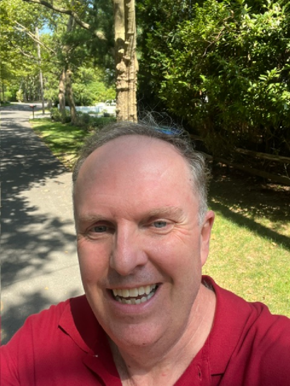
:::

:::

My email address is `Thomas dot Love at case dot edu`.

## Structure of the 431 Course

::: columns

::: {.column width="70%"}
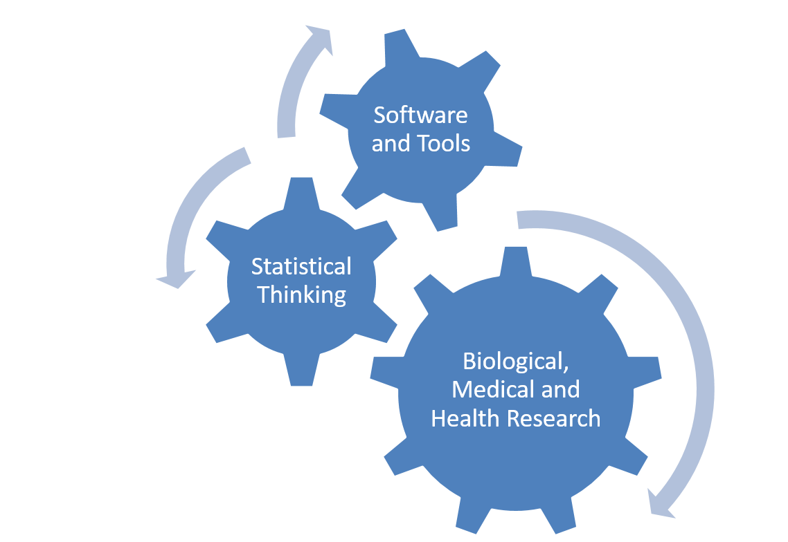
:::

::: {.column width="30%"}

- Exploratory Data Analysis, Visualization
- Statistical Inference, Making Comparisons
- Linear Regression and related Models
:::
:::

## Course Philosophy (in one slide)

The course is about biostatistics, replicable research, using state-of-the-art tools (R, R Studio, Quarto), and thinking about how science is most effectively done.

- It is more a course in **how** to do things (highly applied) rather than a theoretical/mathematical justification for **why** we do them. We focus here on practical work.
- It's mostly about getting you doing data science projects for biological, medical and health applications.

More on all of this in the [Course Syllabus](https://thomaselove.github.io/431-syllabus-2026/), of course.

## What is Data Science about?


Source: Figure 1.1 in <https://r4ds.hadley.nz/intro.html>

## Our Main Website

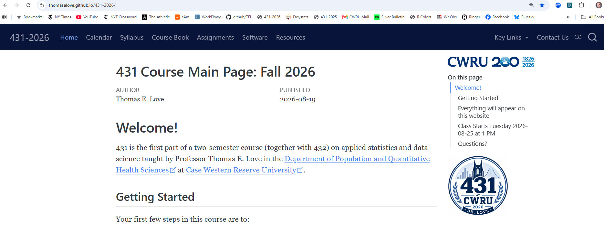

The link to this page is at the bottom of every slide.

## What does [our web site](https://thomaselove.github.io/431-2026/) link to?

- Course [Syllabus](https://thomaselove.github.io/431-syllabus-2026/)
- Course [Calendar](https://thomaselove.github.io/431-2026/calendar.html), which is the final word for all deadlines, and also links to each day's **class page**.
- Course [Notes](https://thomaselove.github.io/431-notes/) (essentially a textbook)
- [Software](https://thomaselove.github.io/431-2026/software.html) Details (R and R Studio, installation, data and code downloads)
- [Assignments](https://thomaselove.github.io/431-2026/assignments.html): 2 projects, 7 labs, 2 quizzes, several minute papers

## Getting Help

If you’ve spent 15 minutes working on something and are stuck, don’t keep working on it. **ASK FOR HELP**. 

- The [Contact Us page](https://thomaselove.github.io/431-2026/contact.html) on our web site provides details on how to get help, one of which is to email **431-help at case dot edu**.

## Teaching Assistants (Fall 2026)

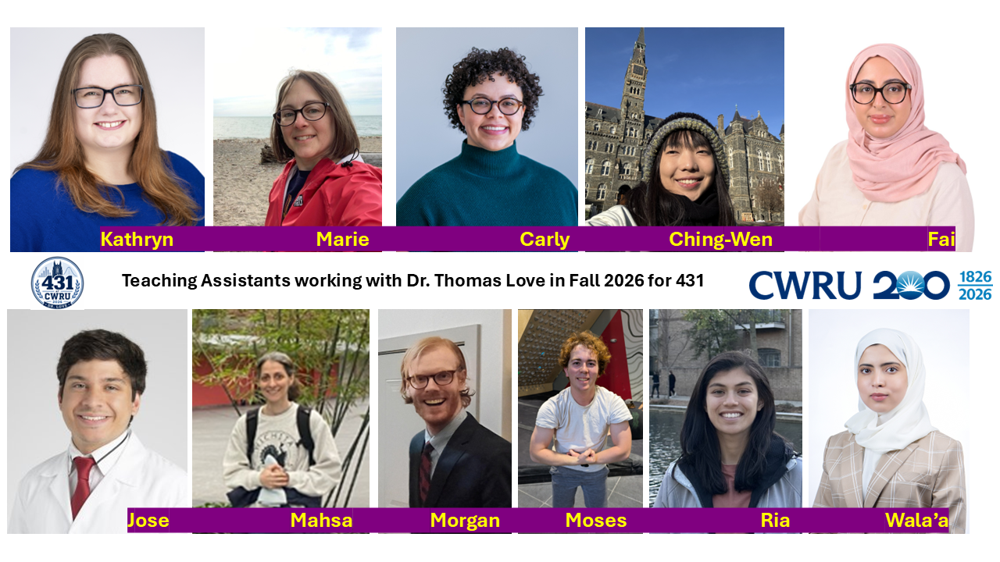

- Learn more about the TAs in our [Syllabus](https://thomaselove.github.io/431-syllabus-2025/08_teachingassistants.html).

## Schedule of TA Office Hours{.smaller}

- TA Office Hours begin Sunday 2026-08-30 and end Tuesday 2026-12-08.

DATE	| TIME(S) (All times Eastern)
---------- | -------------------------------------------------------
Sundays	| 1:00 - 2:00 PM, 5:30 - 8:30 PM
Mondays	| 2:00 - 5:00 PM, 5:30 - 7:30 PM, 8:00 - 9:00 PM
Tuesdays	| 5:30 - 7:30 PM, 9:00 - 10:00 PM
Wednesdays |	none (*most assignments are due Wednesday at NOON*)
Thursdays	| 10:00 AM - Noon
Fridays	| 10:00 AM - Noon, 12:30 - 2:30 PM, 3:00 - 5:00 PM
Saturdays	| 10:00 AM - Noon, 6:00 - 8:00 PM

- Zoom details for each of these sessions appear in [our Shared Google Drive](https://thomaselove.github.io/431-2026/google.html).
- TA office hours are cancelled during Fall Break and Thanksgiving Week.

## What will we be reading?

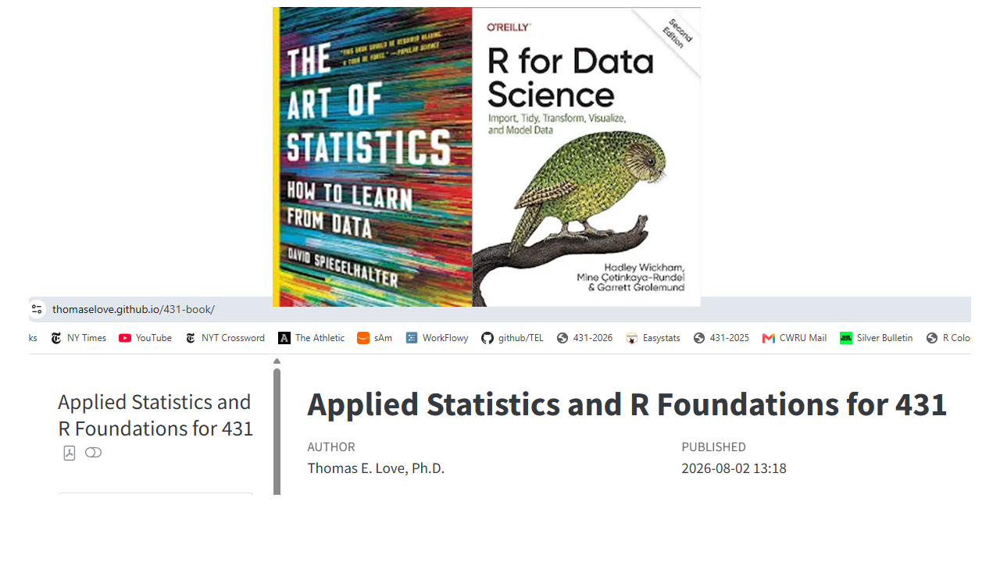

- Readings section of our [Course Calendar](https://thomaselove.github.io/431-2026/calendar.html) for more.

## Tools We Use in 431

- [Calendar](https://thomaselove.github.io/431-2026/calendar.html) (for deadlines and what's next)
- [Canvas](https://canvas.case.edu/) (for submission of work and occasional discussions)
- [Zoom](https://cwru.zoom.us/) (for TA office hours and class recordings)
- [Shared Google Drive](https://thomaselove.github.io/431-2026/google.html) (mostly Lab/Quiz/Project answer sketches and feedback)
- [Main Website](https://thomaselove.github.io/431-2026/) links to everything you'll need 

## Keeping Caught Up

- If you have to miss a class, catch up before the next one.
- We'll usually record the classes using Zoom and make them available afterwards.
    - You'll find the recordings on [Canvas](https://canvas.case.edu/) in the Zoom section. 
    - We prefer you not to join the Zoom live, but rather watch the recording when it is posted (usually the same day.)
- Our assignments have deadlines, which are on the [Calendar](https://thomaselove.github.io/431-2026/calendar.html).

## Attendance Policies

1. We expect you to attend at least 22 of the 26 classes in person. 
2. Don't come if you are sick, please. Watch the recording instead.
3. If you're getting over an illness, but are well enough to attend class, please mask up.
4. If you will need to miss **more than two classes in a row**, or if you cannot keep up with assignments, that's when Dr. Love needs to hear from you. 

## Use of Artificial Intelligence

You will learn some of my opinions about many things this term, including generative AI. As an educator, though, I subscribe to this, mostly: 

**Students should only use AI for things that they already know how to do well.**

When studying, the question I ask myself is "would doing this myself teach me something?" If yes, then don't use AI. If no, then AI is ... well, less of an issue.

- I am grateful to [Rod J. Naquin](https://rodjnaquin.substack.com/) for his [summary](https://x.com/rodjnaquin/status/2090764610596986931?s=58&t=zbcsKLbdp69TQk2_gEIg8A) of this general idea.

## Great Statisticians in History

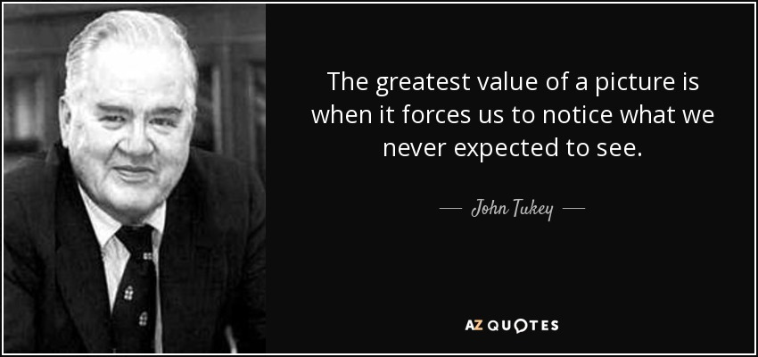 

John **Tukey** (1915-2000)^[Image Source: <http://www.azquotes.com/author/14847-John_Tukey>]

## Things To Do After Class 01 {.smaller}

1. Complete the [Welcome to 431 survey](https://bit.ly/431-2026-welcome) (due **tomorrow** at noon.) 
2. Review the [main course website](https://thomaselove.github.io/431-2026/), being sure to visit the [Course Calendar](https://thomaselove.github.io/431-2026/calendar.html).
3. Read through the [Course Syllabus](https://thomaselove.github.io/431-syllabus-2026/).
4. Obtain David Spiegelhalter's *The Art of Statistics: How to Learn from Data* (~$20) and read the Introduction and Chapter 1.
5. [Install the R and RStudio software](https://thomaselove.github.io/431-2026/software.html) you'll need on a computer you control.
6. Look at Dr. Love's [Course Book](https://thomaselove.github.io/431-book/), especially Chapters 1-3.
7. Take a look at [Lab 01](https://github.com/THOMASELOVE/431-labs-2026/tree/main/lab1) (due 2026-09-09 at noon) which is your first substantial deliverable, and also glance at the instructions for [Project A](https://thomaselove.github.io/431-projectA-2026/).

See the [Class 01 README](https://github.com/THOMASELOVE/431-classes-2026/tree/main/class01) for more details.

## We'll form groups in a moment

- Shortly, we will be asking you each to join a group, containing four or five people. Join a group where you will meet at least one new person.
- Also, one member of each group will serve as recorder and will need to open a Google Form on their laptop in a moment.
  - Everyone else needs nothing except their convenient piece of paper and a pen/pencil.
- Your first task will be to settle on a name for your group. Try to be a little creative.

## Break Time!

A standing break is a short pause in your workday where you stand up and move to rest your muscles and refresh your mind. Sitting for too long can hurt your back, slow your blood circulation, and cause mental fatigue.

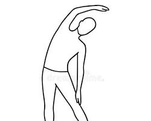 

## We'll be guessing some ages

- I'll display 10 photographs; each shows a person.
- For each photo your group will ...
    + estimate the age of the person in the photo (in years)
    + have the recorder type your (group) guess into the form (so if you guess age 35, you will just type 35.)
- When you've guessed all 10 ages, submit the form. The recorder will get an email confirmation.
- Later, we'll reveal the true ages and compute errors.

## OK. Let's form the groups.

- Remember, your group should have FOUR OR FIVE people, with at least one person you don't already know.

1. Select a group name.
2. Select a recorder, who should visit the link below after logging into Google via CWRU.

<https://tinyurl.com/431-2026-class01-breakout> 

3. Make sure everyone knows everyone else's name, as well as your group's name.

## Here come the photos

- We'll give you a little more time for the first two photos than the other eight.

Remember to have the recorder fill out the form at <https://tinyurl.com/431-2026-class01-breakout> although it may help all of you to keep track on paper, as well.

## Photo 1 

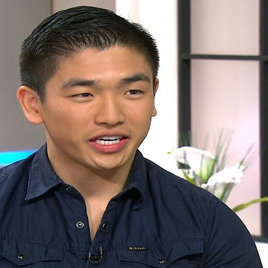

## Photo 2


## Making Progress

- Your group's guess for each photo should be in the form at <https://tinyurl.com/431-2026-class01-breakout>. 
  - You might also want to keep track on your convenient piece of paper, so that when I tell you the ages later, you'll be in a position to see how your group did.
- In spare time between photos, please make the effort to learn **something** about each of the other people in your group beyond their name: perhaps what field they are in, or where they come from.

## Photo 3

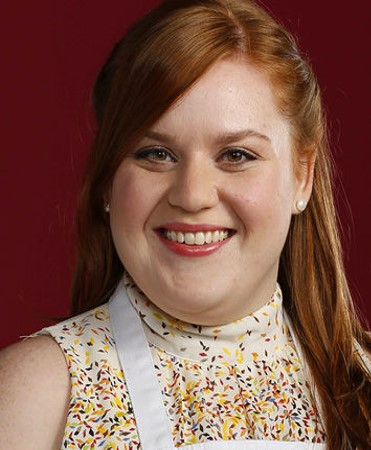

## Photo 4

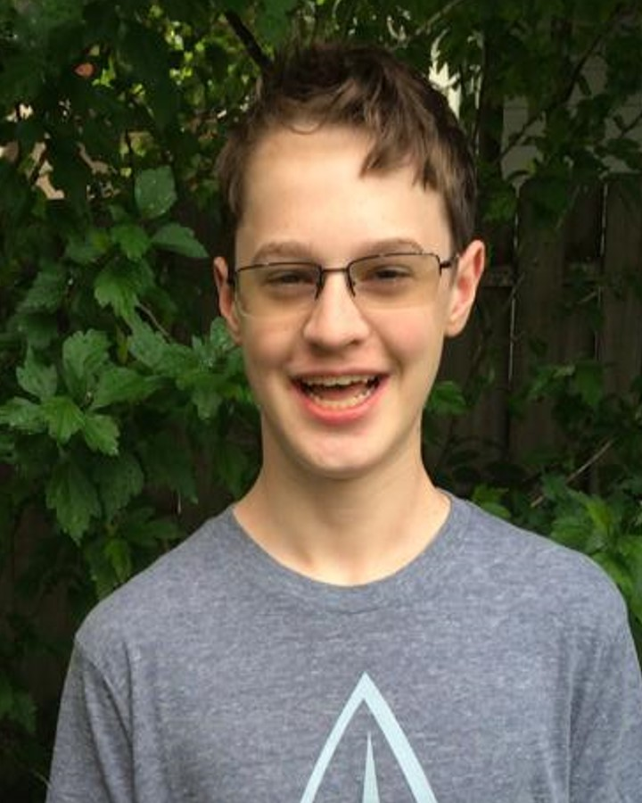


## Photo 5

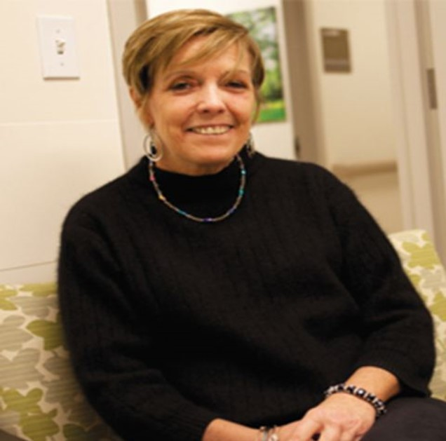


## Photo 6


## Photo 7

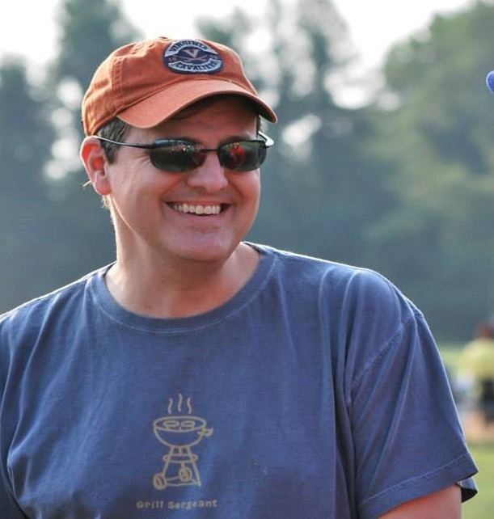

## Photo 8


## Photo 9


## Photo 10

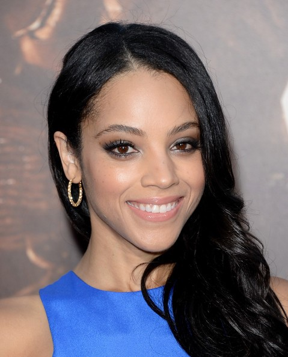

## Now, guess My Age again

1. You should have an initial guess of my age written down from the start of the session.
2. Now, make a second guess of my age based on what you know about me now, and write that down next to the initial guess.

So if you guessed 18 initially, but now think I'm 19, you should write 18/19. If you still think I'm 18, write 18/18. Make it easy for us to understand your guesses of my age on the **convenient piece of paper**. Don't guess my age as a group - just write down your own guess.

## Age Guessing Robots?

Artificial intelligence has produced multiple tools to guess someone's age from their image. 

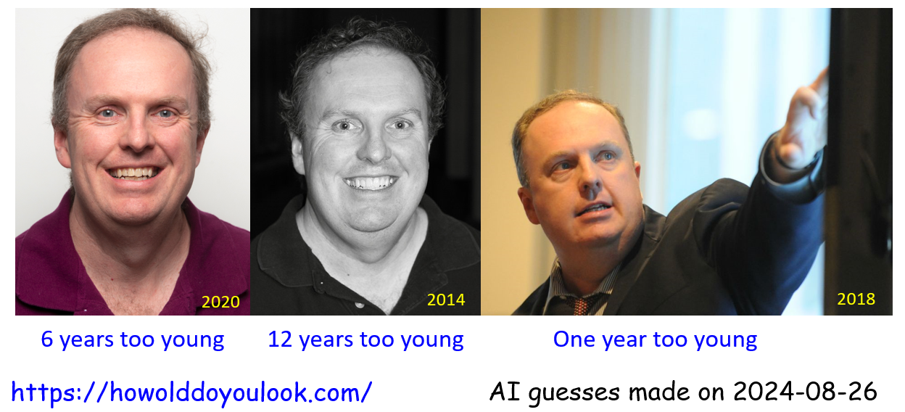

Do you think you did that well?

# OK. Back to the photos!

## Card 1 


## Card 2


## Card 3


## Card 4


## No, not THAT Kevin Love

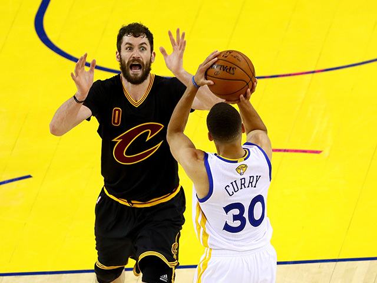

## THIS Kevin Love, at left (Aug 2023)


## Card 5


## Card 6


## Card 7


## Card 8


## Card 9


## Card 10


## How did AI do? (2025-08-21)

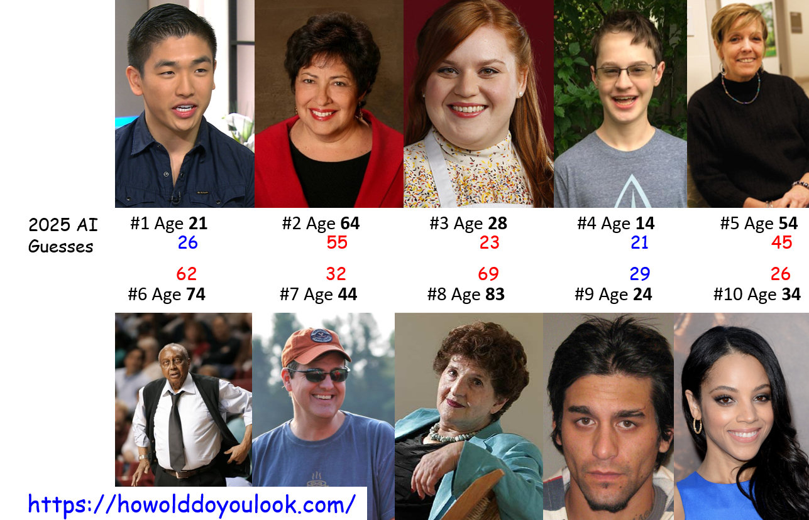

## Reading in Data since 2014

```{r read_data_photos, message=FALSE, echo = TRUE}

library(tidyverse)
ageguess <- read_csv("c01/data/ten-photo-age-history-2025.csv")
ageguess
```

## Scatterplot of Prior Results, 1

```{r guess_vs_true_age_by_year_1, echo=FALSE}
ggplot(ageguess, aes(x = age, y = mean_guess, col = year)) +
  geom_point(size = 3) +
  geom_line(data = ageguess |> filter(year == "2025_AI"), aes(x = age, y = mean_guess), col = "black") +
  theme(axis.text = element_text(size = 14),
        axis.title = element_text(size = 14, face = "bold"),
        legend.text = element_text(size = 12),
        legend.title = element_text(size = 12, face = "bold")) + 
  theme_bw() +
  labs(title = "Age Guessing in Previous Years",
       subtitle = "2014-2025 class guesses, plus 2025 AI",
       x = "True Age", y = "Mean Class-Wide Estimate") 
```

## Revised Scatterplot of Prior Results

```{r guess_vs_true_age_by_year_2, echo=FALSE}
ggplot(ageguess, aes(x = age, y = mean_guess, col = year)) +
  geom_point(position = "jitter", size = 3) +
  geom_abline(intercept = 0, slope = 1) + 
  scale_color_viridis_d(end = 0.75) +
  theme(axis.text = element_text(size = 14),
        axis.title = element_text(size = 14, face = "bold"),
        legend.text = element_text(size = 12),
        legend.title = element_text(size = 12, face = "bold")) +
  labs(title = "Age Guessing in Previous Years",
       subtitle = "Straight Line indicates a Correct Guess",
       x = "True Age", y = "Mean Class-Wide Estimate") + 
  theme_bw()
```

## Mean Class-Wide Guesses (2014-24)

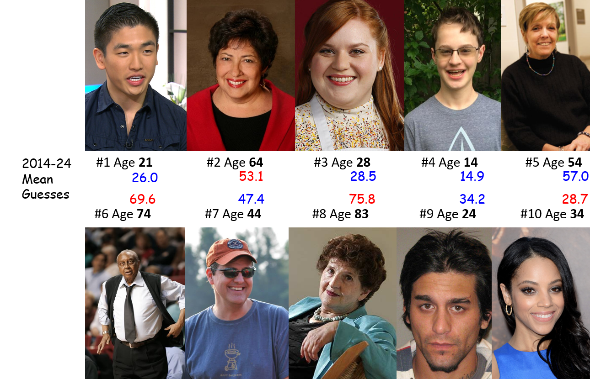

## Distribution of Guesses by Subject

```{r}
temp <- ageguess |> filter(year != "2025_AI")

temp <- temp |> mutate(label = fct_reorder(label, card))

ggplot(temp, aes(x = label, y = mean_guess)) +
  geom_boxplot() + 
  geom_point(aes(x = label, y = age), 
             col = "blue", size = 3, shape = "X") +
  theme_bw() +
  labs(title = "Boxplot of Guesses by Subject, 2014-25",
       subtitle = "Blue X indicates actual Age",
       x = "Subject's Last Name (from Card 1 to Card 10)",
       y = "Age (in years)",
       caption = "AI guesses not included")
```

## 2025 Results: Labeled Scatterplot

```{r, echo = FALSE}
ggplot(filter(ageguess, year == 2025), aes(x = age, y = error, fill = sex)) +
  geom_label(aes(label = label)) +
  geom_hline(yintercept = 0) + 
    guides(fill = "none") +
  theme(axis.text = element_text(size = 14),
        axis.title = element_text(size = 14, face = "bold"),
        legend.text = element_text(size = 12),
        legend.title = element_text(size = 12, face = "bold")) +
  labs(title = "Errors in 2025 Age Guessing, by Subject's Sex",
       x = "True Age", y = "Error in Class-Wide Estimate") + 
    theme_bw() + 
    facet_wrap(~ sex)
```

## Thanks for coming! {.smaller}

See you Thursday at 1 PM right here.

1. Complete the [Welcome to 431 survey](https://bit.ly/431-2026-welcome) (due **tomorrow** at noon.) 
2. Review the [main course website](https://thomaselove.github.io/431-2026/), being sure to visit the [Course Calendar](https://thomaselove.github.io/431-2026/calendar.html).
3. Read through the [Course Syllabus](https://thomaselove.github.io/431-syllabus-2026/).
4. Obtain David Spiegelhalter's *The Art of Statistics: How to Learn from Data* (~$20) and read the Introduction and Chapter 1.
5. [Install the R and RStudio software](https://thomaselove.github.io/431-2026/software.html) you'll need on a computer you control.
6. Look at Dr. Love's [Course Book](https://thomaselove.github.io/431-book/), especially Chapters 1-3.
7. Take a look at [Lab 01](https://github.com/THOMASELOVE/431-labs-2026/tree/main/lab1) (due 2026-09-09 at noon) which is your first substantial deliverable, and also glance at the instructions for [Project A](https://thomaselove.github.io/431-projectA-2026/).
