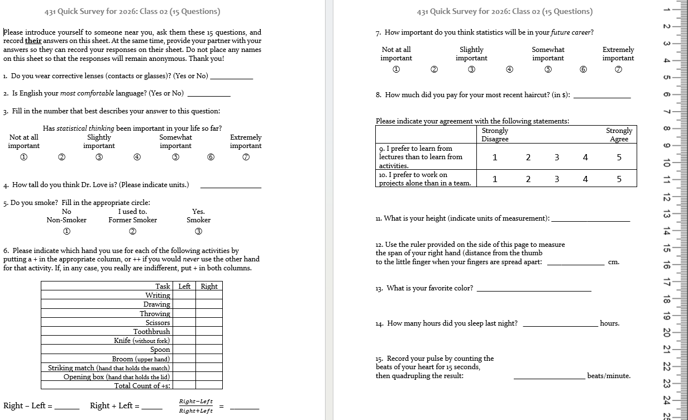
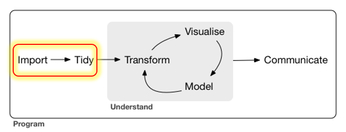
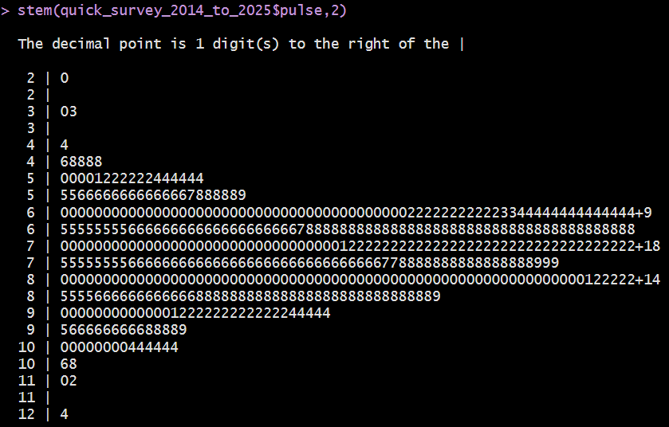
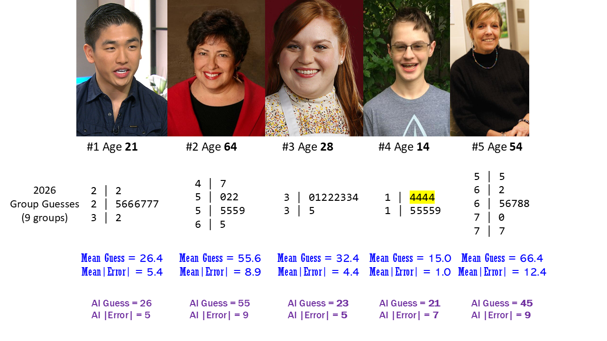
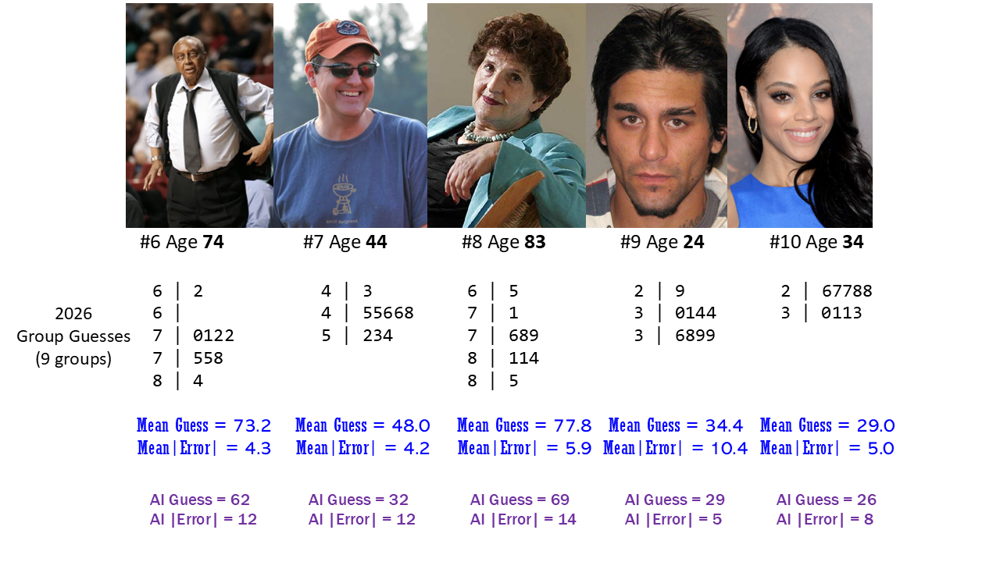
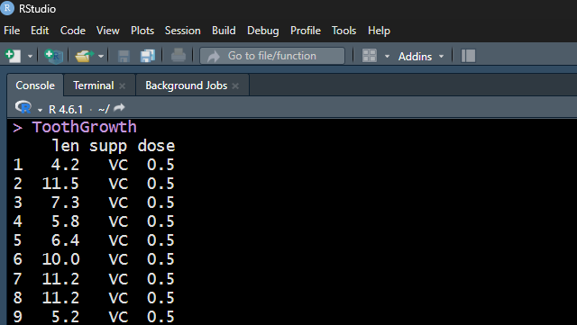

## Today's Agenda

- Data Structures and Variables
    - Evaluating the in-class survey you just completed
- Evaluating some built-in data from R
    - An experiment in tooth growth and Vitamin C
- Looking at some of the data collected in Class 1
    - Group Guessing of Ages from 10 Photographs
    - Guessing Dr. Love's Age (twice)
- Welcome to 431 Survey (see Class 2 README)

## The R Packages I'll Load Today

```{r}
#| echo: true
#| message: false

library(janitor)
library(knitr)
library(rstanarm)
library(easystats)
library(tidyverse)

source("c02/data/Love-431.R")

knitr::opts_chunk$set(comment = NA)
```

- If you actually run this in R, you will get some messages which we will suppress and ignore today.

## Six Rules for Data Analysis

1.  Do not attempt to analyze the data until you understand what is being measured and why.
2.  Find out how the data were collected.
3.  Look at the structure of the data.
4.  Carefully examine the data in an exploratory way, before attempting a more sophisticated analysis.
5.  Use your common sense at all times.
6.  Report the results in a clear, self-explanatory way.

::: aside
Chatfield, Chris (1996) *Problem Solving: A Statistician's Guide*, 2nd ed.
:::

## Our Quick Survey



## Types of Data

The key distinction we'll make is between

- **quantitative** (numerical) and
- **categorical** (qualitative) information.

Information that is quantitative describes a **quantity**.

- All quantitative variables have units of measurement.
- Quantitative variables are recorded in numbers, and we use them as numbers (for instance, taking a mean of the variable makes some sense.)

## Continuous vs. Discrete Quantities

**Continuous** variables (can take any value in a range) vs. **Discrete** variables (limited set of potential values)

-   Is Height a continuous or a discrete variable?

::: incremental
- Height is certainly continuous as a concept, but how precise is our ruler?
- Piano vs. Violin
:::

## Quantitative Variable Subtypes

We can also distinguish **interval** (equal distance between values, but zero point is arbitrary) from **ratio** variables (meaningful zero point.)

::: incremental
- Is Weight an interval or ratio variable?
- How about IQ?
:::

## Qualitative (Categorical) Data

Qualitative variables consist of names of categories.

- Each possible value is a code for a category (could use numerical or non-numerical codes.)
    - **Binary** categorical variables (two categories, often labeled 1 or 0)
    - **Multi-categorical** variables (three or more categories)
- Can distinguish *nominal* (no underlying order) vs. *ordinal* (categories are ordered.)

## Some Categorical Variables

- How is your overall health? <br /> (Excellent, Very Good, Good, Fair, Poor)
- Which candidate would you vote for if the election were held today?
- Did this patient receive this procedure?
- If you needed to analyze a small data set right away, which of the following software tools would you be comfortable using to accomplish that task?

## Quantitative or categorical? {.smaller}

1. Do you **smoke**? (1 = Non-, 2 = Former, 3 = Smoker)
2. How much did you pay for your most recent **haircut**? (in $)
3. What is your favorite **color**?
4. How many hours did you **sleep** last night?
5. Statistical thinking in your future **career**? (1 = Not at all to 7 = Extremely important)

- If quantitative...
    - are they *discrete* or *continuous*? 
    - Do they have a meaningful *zero point*?
- If categorical...
    - How many categories? 
    - Are the categories *nominal* or *ordinal*?

## Importing and Tidying Data



## Ingesting the Quick Surveys


## The Quick Survey

Since 2014, 656 students took (essentially) this survey.

| Fall | 2025 | 2024 | 2023 | 2022 | 2021 | 2020 | 
|-----:|-----:|-----:|-----:|-----:|-----:|-----:|
|  *n* |   53 |   56 |   53 |   54 |   58 |   67 |


| Fall | 2019 | 2018 | 2017 | 2016 | 2015 | 2014 |   Total |
|-----:|-----:|-----:|-----:|-----:|-----:|-----:|--------:|
|  *n* |   61 |   51 |   48 |   64 |   49 |   42 | **656** |

### Question

What percentage of those 656 surveys caused *no problems* in recording responses?

## The 15 Survey Items{.smaller}

|  \# | Topic          |  \# | Topic                    |
|----:|----------------|----:|--------------------------|
|  Q1 | `glasses`      |  Q9 | `lectures_vs_activities` |
|  Q2 | `english`      | Q10 | `projects_alone`         |
|  Q3 | `stats_so_far` | Q11 | `height`                 |
|  Q4 | `guess_TL_ht`  | Q12 | `hand_span`              |
|  Q5 | `smoke`        | Q13 | `color`                  |
|  Q6 | `handedness`   | Q14 | `sleep`                  |
|  Q7 | `stats_future` | Q15 | `pulse_rate`             |
|  Q8 | `haircut`      |  \- | \-                       |

-   At one time, I asked about `sex` rather than `glasses`.
-   In prior years, people guessed my age, rather than height here.
-   Sometimes, I've asked for a 30-second pulse check, then doubled.

## Response to the Question I asked

What percentage of those 656 surveys caused *no problems* in recording responses?

::: incremental

- Let's categorize your guesses...
    - Over 80% were OK (*caused no problems*)?
    - 61 to 80%?
    - 41 to 60%?
    - 0 to 40%?
- Actually ...
    - 235/656 (36%) caused no problems.

:::

## Guess My Age


What should we do in these cases?

## English best language?


## Height


## Handedness Scale (2016-21 version)


## Favorite color


## Following the Rules? (2019 version)


### 2019 `pulse` responses, sorted (*n* = 61, 1 NA)

```         
 33  46  48  56  60  60            3 | 3
 62  63  65  65  66  66            4 | 68
 68  68  68  69  70  70            5 | 6
 70  70  70  70  70  70            6 | 002355668889        
 71  72  72  74  74  74            7 | 00000000122444445666888
 74  74  75  76  76  76            8 | 000012445668
 78  78  78  80  80  80            9 | 000046
 80  81  82  84  84  85           10 | 44
 86  86  88  90  90  90           11 | 0
 90  94  96 104 104 110 
```

## Pulse Rates: 2014-2025



This **stem-and-leaf** display is thanks to John **Tukey**.

## Garbage in, garbage out ...


::: aside

In Class 3, we'll look at the data from today's survey.

:::

# Group Age Guessing from Photos <br /> (9 groups in 2026, 10 Photos)

## Photos 1-5



## Photos 6-10



## We had 9 groups in 2026

ANOVAs, Beavers, New Beginnings, Static Five, The Tom Tukeys, The Tropic of Answer, Tukey Time, We ♥ Cleveland, World Gators

**Which group wins?** How should we judge/measure this?

:::{.incremental}

- Most correct guesses out of the 10 photos?
    - Only four groups had a correct guess, all on my son.
- Most guesses *within 2* years? Maybe *within 5* years?
- Most times beating the *AI bot*?
  - <https://howolddoyoulook.com/> on 2025-08-21.

:::

## 2026 Groups + AI: Ten Photos {.smaller}

2026 <br> Group | Within <br> 2 | Within <br> 5 | Too <br> Low | <br> Correct | Too <br> High | Beat <br> AI
:----------------:|:-----:|:-----:|:-----:|:-----:|:-----:|:-----:|:-----:
We ♥ Cleveland | 3 | 6 | 4 | **1** | 5 | **7**
World Gators | 2 | 5 | 2 | **1** | 7 | 6
Beavers | **4** | 5 | 4 | **1** | 5 | 6
Static Five | 3 | **7** | 3 | **1** | 6 | 5
Tropic of Answer | 1 | 5 | 3 | 0 | 7 | **7**
ANOVAs | **4** | 6 | 1 | 0 | 9 | 6
New Beginnings | **4** | 6 | 4 | 0 | 6 | 6
Tukey Time | 3 | 5 | 4 | 0 | 6 | 6
The Tom Tukeys | 3 | 4 | 4 | 0 | 6 | 5
*AI (2025)* | *0* | *3* | *7* | *0* | *3* | *--*


## Consider the AI (2025) results {.smaller}

Subject | Photo | AI guess | True Age | Error
:-------: | -----: | :-----: | :------: | :-----:
Chong | 1 | 26 | 21 | 5
Archuleta | 2 | 55 | 64 | -9
Mayfield | 3 | 23 | 28 | 5
... | 
Lawson | 10 | 26 | 34 | -8

Sum of AI errors = 5 + (-9) + (-5) + 7 + (-9) + (-12) + (-12) + (-14) + 5 + (-8) = -52

::: incremental
- Mean of AI errors across 10 photos is -5.2 years.
- Minimum AI error is -14 years, Maximum AI error is 7 years 
- Median of the AI errors = -8.5 years.
- Standard Deviation of the AI errors = 7.9 years.
:::

## 2026 Summaries Set 2 {.smaller}

2026 Groups | Mean Error | SD (Err) | Median (Err) | (Min, Max) Err |
|:----------:|:--------:|:--------:|:--------:|:--------:|
We ♥ Cleveland | 1.4 | 7.4 | **0.5** | (-9, 15)
World Gators | 5.3 | 8.8 | 5 | (-7, 23)
Beavers | 1.6 | 7.9 | 1 | (-12, 14)
Static Five | 0.7 | 8.4 | 1.5 | (-18, 14)
Tropic of Answer | 2.7 | 7.6 | 4 | (-12, 15)
ANOVAs | 5.6 | 5.4 | 4.5 | (**-1**, 16)
New Beginnings | **0.3** | 7.7 | 1 | (-14, 14)
Tukey Time | 1.5 | 7 | 1 | (-9, 13)
The Tom Tukeys | -2.6 | 9 | 1 | (-17, **10**)
*AI (2025)* | *-5.2* | *7.9 *| *-8.5* | (*-14, 7*)

## Summaries of Errors

- How helpful are the summaries on the previous slide?
- Should we be looking at |error| or maybe squared error?

AI errors were: 5, -9, -5, 7, -9, -12, -12, -14, 5, -8

::: incremental
- Sum of the AI errors is -52, and mean error is -5.2
- For AI, sum of the |errors| = 86, so mean absolute error (**AE**) = 8.6 years
- Sum of squared errors (**SSE**) is 834, so mean squared error is 83.4, whose square root (**RMSE**) = 9.13
:::

## Absolute and Squared Errors {.smaller}

Group         | Mean AE | Range (AE) | Median AE | SSE | RMSE 
:--------------------:|:--------:|:----------:|:----------:|:-----:|:-----:
We ♥ Cleveland | 5.6 | (0, 15) | **4** | 516 | 7.18
World Gators | 7.7 | (0, 23) | 6 | 979 | 9.89
Beavers | 6.0 | (0, 14) | 5 | 584 | 7.64
Static Five | 5.9 | (0, 18) | 5 | 645 | 8.03
Tropic of Answer | 6.5 | (1, 15) | 5.5 | 593 | 7.70
ANOVAs | 5.8 | (1, 16) | 4.5 | 574 | 7.58
New Beginnings | 5.7 | (1, 14) | 4.5 | 541 | 7.36
Tukey Time | **5.5** | (1, **13**) | 5 | 463 | **6.80**
The Tom Tukeys | 7.2 | (1, 17) | 7 | 796 | 8.92
*AI (2025)* | *8.6* | (*5, 14*) | *8.5* | *834* | *9.13*

## So now who wins? {.smaller}

<br> Group         | Mean <br> AE | Range <br> (AE) | Median <br> AE | <br> RMSE | Within <br>  2 | Within <br> 5 | Beat <br> AI
:--------------------:|:-----:|:----------:|:----------:|:-----: | :-----: | :-----: | :----:
We ♥ Cleveland | 5.6 | (0, 15) | **4** | 7.18 | 3 | 6 | **7**
World Gators | 7.7 | (0, 23) | 6 | 9.89 | 2 | 5 | 6
Beavers | 6 | (0, 14) | 5 | 7.64 | **4** | 5 | 6
Static Five | 5.9 | (0, 18) | 5 | 8.03 | 3 | **7** | 5
Tropic of Answer | 6.5 | (1, 15) | 5.5 | 7.7 | 1 | 5 | **7**
ANOVAs | 5.8 | (1, 16) | 4.5 | 7.58 | 3 | 6 | 6
New Beginnings | 5.7 | (1, 14) | 4.5 | 7.36 | **4** | 6 | 6
Tukey Time | **5.5** | (1, **13**) | 5 | **6.80** | 3 | 5 | 6
The Tom Tukeys | 7.2 | (1, 17) | 7 | 8.92 | 3 | 4 | 5
*AI (2025)* | *8.6* | (*5, 14*) | *8.5* | *9.13* | *0* | *3* | --

## Importing guesses from 2014-2026

```{r}
#| echo: true

photos <- 
  read_csv("c02/data/ten-photo-age-history-2026.csv",
           show_col_types = F)

photos <- photos |>
  mutate(label = fct_reorder(label, card))

head(photos)
```

## 2014-2025 Errors vs. 2026

```{r}
#| echo: false
ggplot(photos |> filter(year != "2025_AI" & year != "2026"), aes(x = label, y = error)) +
  geom_point(aes(col = year, fill = year), size = 3) +
  geom_point(data = photos |> filter(year == "2026"), aes(x = label, y = error), col = "black", shape = "X", size = 7) +
  geom_hline(yintercept = 0) +
  scale_color_metro() +
  labs(title = "2014-2025 error sizes as compared to 2026", 
       subtitle = "Black X indicates error of 2026 average group guess",
       x = "",
       y = "Average Guessing Error") +
  theme_light()
```


# Standing Break <br> When we return, we'll explore a "built-in" R data set {autoslide=135000}

## R Console in RStudio



## The `ToothGrowth` data

:::: {.columns}

::: {.column width="70%"}

These data describe the length (`len`) of *odontoblasts* (cells responsible for tooth growth) in 60 guinea pigs.

- Each received one of three `dose` levels of vitamin C (0.5, 1 or 2 mg/day) 
- delivered by either 
    - `supp` = VC for asorbic acid, or
    - `supp` = OJ for orange juice
:::

:::{.column width = "25%"}


Photo: [Wikipedia](https://en.wikipedia.org/wiki/Odontoblast)

:::

::::

::: aside

I *think* the `len`gths are measured in micrometers (µm), also known as microns.

:::

## Show me the data...

```{r}
#| echo: true

ToothGrowth
```

## We prefer tibbles to data frames

```{r}
#| echo: true

TG_new <- ToothGrowth |> as_tibble()
TG_new
```

- Since `TG_new` is a *tibble*, printing it shows the first 10 rows and its dimensions and variable types.

## `head()` and `tail()` of the data

```{r}
#| echo: true

head(TG_new)
tail(TG_new)
```


## Exploring the Data

```{r}
#| echo: true
summary(TG_new)
TG_new |> tabyl(supp, dose)
sort(TG_new$len)
```

## Some of my favorite summaries

```{r}
#| echo: true
TG_new |> reframe(lovedist(len)) 
```

- *n* = 60 observations, 
- *miss* = 0, so no missing data
- *mean* = "average" (sum of values / number of values)
- *med* = median (middle value when data are sorted)

## Some of my favorite summaries (2)

```{r}
#| echo: true
TG_new |> reframe(lovedist(len)) 
```

Measures of **Spread** or variation:

- *sd* = standard deviation (formula in [our book](https://thomaselove.github.io/431-book/03_summary.html#mean-and-sd-median-and-mad))
- *mad* = median absolute deviation (formula in [our book](https://thomaselove.github.io/431-book/03_summary.html#mean-and-sd-median-and-mad))
- *min*, *max* = minimum and maximum value
- *q25*, *q75* = 25th and 75th quantiles (percentiles)

## Histogram of odontoblast lengths

```{r}
#| echo: true
#| message: true
ggplot(data = TG_new, aes(x = len)) +
  geom_histogram()
```

## Version 2: set bin width and colors

```{r}
#| echo: true
ggplot(data = TG_new, aes(x = len)) +
  geom_histogram(binwidth = 1, fill = "navy", col = "yellow") 
```

## Version 3: try 10 bins, set labels

```{r}
#| echo: true
ggplot(data = TG_new, aes(x = len)) +
  geom_histogram(bins = 10, fill = "navy", col = "yellow") +
  labs(title = "Odontoblast lengths for 60 guinea pigs",
       x = "Odontoblast length", y = "Number of animals") 
```

## What to do about `dose`?

The guinea pigs were randomly allocated to receive one of three doses:

- 0.5 mg/day
- 1.0 mg/day
- 2.0 mg/day

with 20 animals at each `dose`.

- How can we picture the relationship between `dose` and odontoblast length (`len`)?

## Plotting `len` by `dose`?

```{r}
#| echo: true

ggplot(TG_new, aes(x = dose, y = len)) +
  geom_point()
```

## Treat `dose` as a categorical *factor*

```{r}
#| echo: true

ggplot(TG_new, aes(x = factor(dose), y = len)) +
  geom_violin() +
  geom_point()
```

## Add boxplots, sample means

```{r}
#| echo: true

ggplot(TG_new, aes(x = factor(dose), y = len)) +
  geom_violin(fill = "skyblue") +
  geom_boxplot(aes(width = 0.2)) +
  stat_summary(fun = mean, geom = "point", size = 3, col = "red") 
```

## Numerical summary (`len` by `dose`)

```{r}
#| echo: true
TG_new <- TG_new |> mutate(dose_f = as_factor(dose))

TG_new |> reframe(lovedist(len), .by = dose_f)
```

- When assessing the center of these distributions by dose, is it better to use a mean or a median?


## What to do about `supp`?

The guinea pigs were also randomly allocated to receive either ascorbic acid (`supp` = VC) or orange juice (`supp` = OJ) so that we have 10 animals at each combination of one of the three `dose`s and one of the two `supp`s.

- How does the relationship we observed between `dose` and odontoblast length (`len`) change when we take into account the `supp` method?

One approach: show the same type of plot, but separated (faceted) by `supp`...

## Impact of `dose` *and* `supp`?

Result of adding the `facet_wrap()` line shown on next slide...

```{r}
#| echo: true
#| output-location: slide

ggplot(TG_new, aes(x = dose_f, y = len)) +
  geom_violin(fill = "skyblue") +
  geom_boxplot(aes(width = 0.2)) +
  stat_summary(fun = mean, geom = "point", size = 3, col = "red") +
  facet_wrap(~ supp, labeller = "label_both")
```

## Summarizing `len` by `dose` and `supp`

```{r}
#| echo: true

TG_new |> group_by(dose_f, supp) |> reframe(lovedist(len))
```


# Guesses from Class 1 of My Age (Twice)

## From our 431-Data Page: A `.csv` file

`love-age-guesses-2022-2026.csv` is on [our 431-data page](https://github.com/THOMASELOVE/431-data).


## Creating the `age_guess` Tibble

Clicking on RAW in the 431-data presentation takes us to a (long) URL that contains the raw data in this sheet.

I'll read in the sheet's data to a new **tibble** (useful version of an R data frame) called `age_guess` using the `read_csv()` function. 

```{r}
#| echo: true

url_age <- 
  "https://raw.githubusercontent.com/THOMASELOVE/431-data/refs/heads/main/data/love-age-guesses-2022-2026.csv"

age_guess <- read_csv(url_age, show_col_types = FALSE)

```

## What have we created?

```{r}
#| echo: true

age_guess
```

::: aside

This is a *tibble*, so it prints first 10 rows, shows dimensions and variable types.

:::

## Numerical Summary 

```{r}
#| echo: true
summary(age_guess)
```

::: {.callout-tip}

### Looking this over ...

- Why is `student` summarized differently?
- What does `NA's : 5` mean in `guess2`?
- Is this summary of `year` helpful?

:::

## Turning `year` into a factor

```{r}
#| echo: true

age_guess <- age_guess |> mutate(year = as.factor(year))
summary(age_guess)
```

::: {.callout-tip}

### Looking this over ...

- Was the average guess larger on guess 1 or 2?
- What was the range of first guesses? Second guesses?
- In what `year` do you think people guessed I was oldest?

:::


## In which year did I look oldest?

Create *facets* separating out each year's `guess1`s...

```{r}
#| echo: true
#| output-location: slide
ggplot(age_guess, 
       aes(x = guess1, fill = year)) +
  geom_histogram(binwidth = 1, col = "white") +
  scale_fill_metro_d(guide = "none") +
  facet_grid(year ~ .) +
  labs(
    x = "First Guess of Dr. Love's Age",
    y = "# of Students",
    title = "Distribution of first guesses over the past five years",
    subtitle = "Dr. Love's Actual Age = 55.5 in 2022, 59.5 in 2026")
```

## Same plot with binwidth doubled

```{r}
#| echo: false
ggplot(age_guess, 
       aes(x = guess1, fill = year)) +
  geom_histogram(binwidth = 2, col = "white") +
  scale_fill_metro_d(guide = "none") +
  facet_grid(year ~ .) +
  labs(
    x = "First Guess of Dr. Love's Age",
    y = "# of Students",
    title = "Distribution of first guesses over the past five years",
    subtitle = "Dr. Love's Actual Age = 55.5 in 2022, 59.5 in 2026")
```

## Comparison Boxplot (w/violins)

```{r}
#| echo: false
ggplot(age_guess, aes(x = year, y = guess1)) +
  geom_violin(aes(fill = year)) +
  geom_boxplot(width = 0.2) +
  stat_summary(fun = "mean", geom = "point", size = 4, pch = 18, col = "purple") +
  scale_fill_brewer(palette = "Pastel1", guide = "none") +
  labs(y = "Year", x = "First Guess of Dr. Love's Age",
    title = "Distribution of first guesses over the past five years",
    subtitle = "Dr. Love's Actual Age = 55.5 in 2022, 59.5 in 2026",
    caption = "Sample means shown with purple diamonds")
```

## Histogram of Guess Changes

What will this look like?

```{r}
#| echo: true
#| warning: false
#| message: false
#| output-location: slide

age_guess <- age_guess |> mutate(change = guess2 - guess1)

ggplot(data = age_guess, aes(x = change)) +
  geom_histogram(binwidth = 1, fill = "royalblue", col = "white") + 
  labs(x = "Change from first to second guess",
       y = "Students in 431 for Fall 2022-2026",
       title = "Most stayed close to their first guess.") +
  theme_light()
```


## Guess 1 vs. Guess 2 Scatterplot

```{r}
#| echo: true
#| warning: true
ggplot(data = age_guess, aes(x = guess1, y = guess2)) +
  geom_point() 
```

## Filter to complete cases, and add loess smooth

```{r}
#| echo: true
#| output-location: slide
temp <- age_guess |>
  filter(complete.cases(guess1, guess2))

ggplot(data = temp, aes(x = guess1, y = guess2)) +
  geom_point() +
  geom_smooth(method = "loess", formula = y ~ x, col = "blue")
```


## Remove range around smooth; add regression line

```{r}
#| echo: true
#| output-location: slide
ggplot(data = temp, aes(x = guess1, y = guess2)) +
  geom_point() +
  geom_smooth(method = "loess", formula = y ~ x, se = FALSE, col = "blue") +
  geom_smooth(method = "lm", formula = y ~ x, col = "red")
```

## What is that regression line?

```{r}
#| echo: true
fit1 <- lm(guess2 ~ guess1, data = age_guess)
fit1
model_parameters(fit1)
```

::: aside
By default, `lm` filters to complete cases.
:::

## Bayesian linear regression instead?

Here, we'll use the default set of *weakly informative* priors for these coefficients, which will likely yield a model very similar to what `lm` produced^[If you have no idea what I'm talking about, we'll get there in a few weeks.].

```{r}
#| echo: true
set.seed(431)
fit2 <- stan_glm(guess2 ~ guess1, data = age_guess, refresh = 0)
model_parameters(fit2)
```

::: aside

Recall the `lm` model equation: **guess2 = 23.01 + 0.62 guess1**.

:::

## 2026: 1st vs. 2nd Guesses

```{r}
#| echo: true
#| output-location: slide

ggplot(data = temp |> filter(year == "2026"), aes(x = guess1, y = guess2)) +
  geom_point() +
  geom_smooth(method = "loess", formula = y ~ x, se = FALSE, col = "blue") +
  geom_label(x = 51.5, y = 53.5, label = "loess smooth", col = "blue") +
  geom_smooth(method = "lm", formula = y ~ x, se = FALSE, col = "red") +
  geom_label(x = 52, y = 57.5, label = "lm fit", col = "red") +
  geom_abline(intercept = 0, slope = 1, col = "black") +
  geom_label(x = 53, y = 52, label = "y = x", col = "black") +
  geom_vline(xintercept = 59.5, col = "slateblue", lty = "dashed") +
  geom_label(x = 59.5, y = 54, label = "59.5", col = "slateblue") +
  labs(x = "First Guess of Love's Age",
       y = "Second Guess of Love's Age",
       title = "Student Guesses of Dr. Love's Age in 2026",
       subtitle = "Love's actual age = 59.5 in 2026") 
```

Here, I've added a black line to indicate *y = x* (guess is the same) and labeled the three superimposed "smooths."

## R Session Information

```{r}
#| echo: true

xfun::session_info()
```

