## Today's Agenda

- Using RStudio, R and Quarto
    - R Projects, Quarto template, Rendering HTML
- Using a "built in" R data frame ([iris](https://en.wikipedia.org/wiki/Iris_flower_data_set), then [ToothGrowth](https://stat.ethz.ch/R-manual/R-devel/library/datasets/html/ToothGrowth.html))
    - Data management and cleaning 
    - Visual and numerical summaries, fitting models
- Some Thoughts on Project A

# Getting started in a reliable way

## Gathering the files we'll need

From our [431-data page](https://github.com/THOMASELOVE/431-data), you should find:

- `431-first-r-template.qmd` (Quarto starting point)
- `Love-431.R` (my R script containing `lovedist()`)
- `class02_survey_2014_to_2026.csv` (we'll use in class 4)
- `class02_survey_2026.csv` (also for class 4)
- `class03_toothgrowth_complete.qmd` (today's goal)

## Today's Plan

We're using Quarto to gather together into a single document:

- the R code we build, 
- text commenting on and reacting to that R code, and 
- the output of the analyses we build.

Everything in these slides is in the Quarto file for today.

## Create a directory on my computer

I'll create **431-class03** on my D drive.

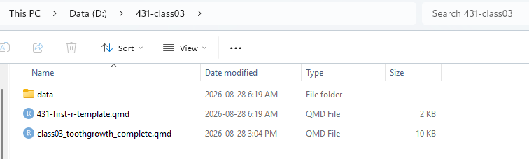

## What's in the `data` subdirectory?

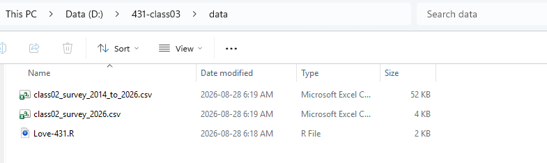

## Where did I get these files?

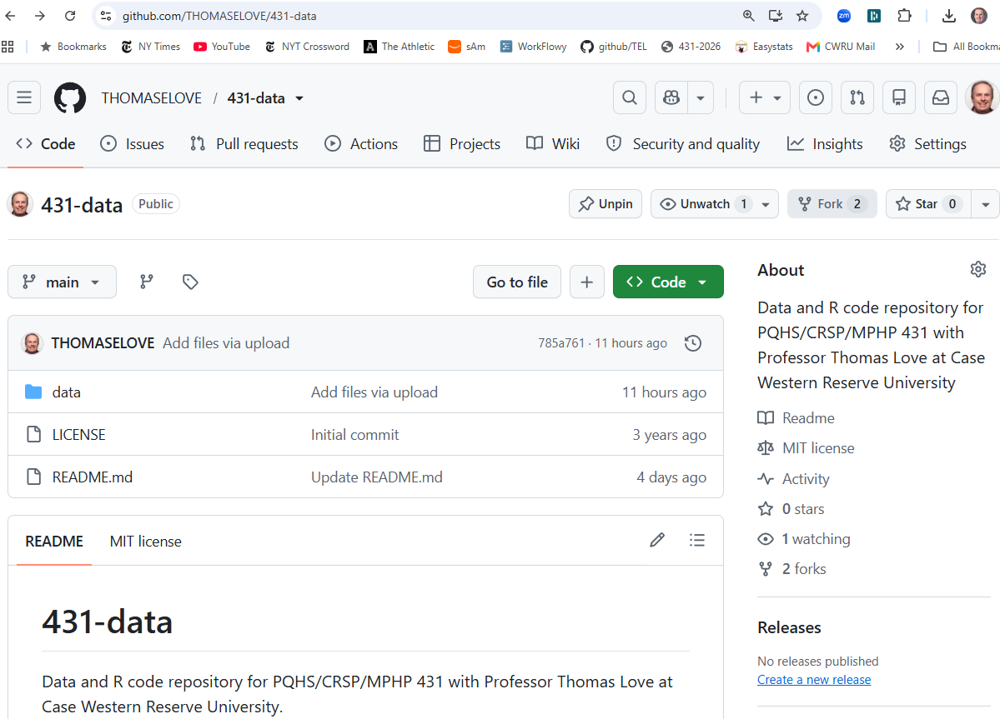

## 431-data page: data subdirectory

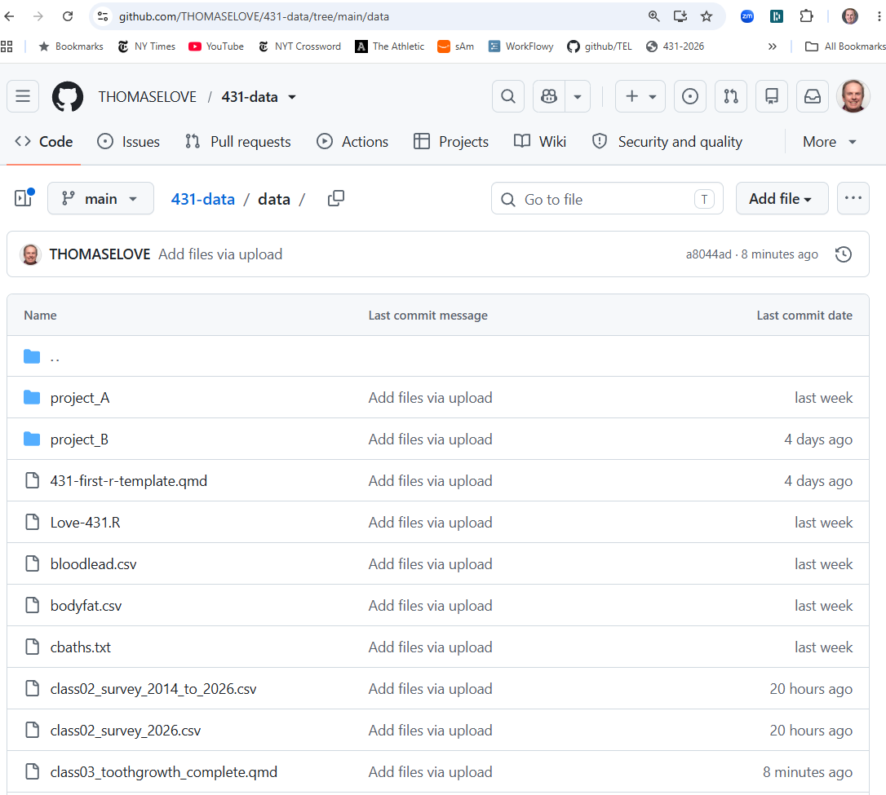

## Open RStudio

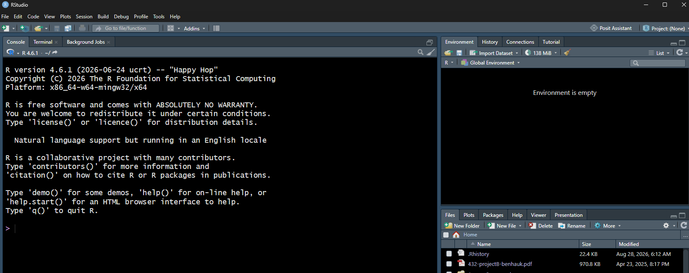

## My RStudio setup

Visit **Tools** ... **Global Options**

- under *Appearance*, I use
    - RStudio theme: Modern
    - Editor font: Lucida Console
    - Editor theme: Tomorrow Night Bright

## Start by creating a new R Project

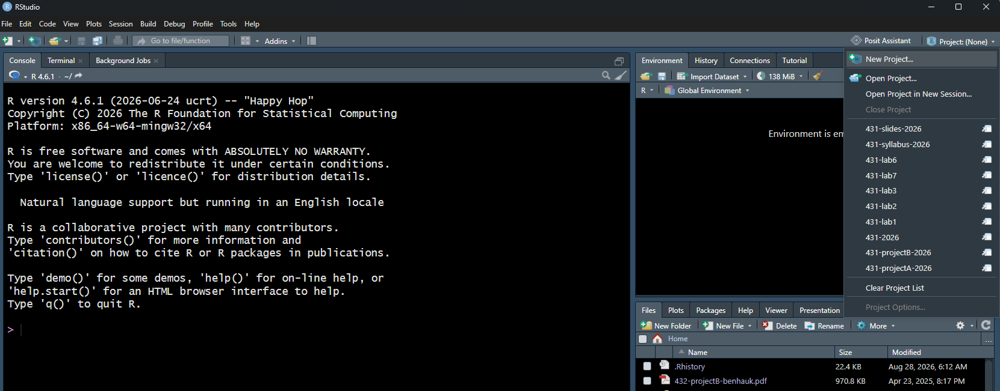

## New Project Wizard

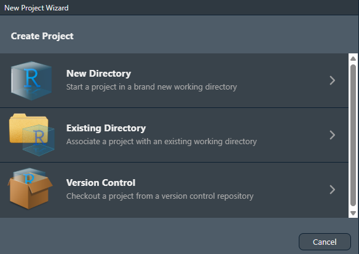

Here, I'll select Existing Directory.

## Create Project

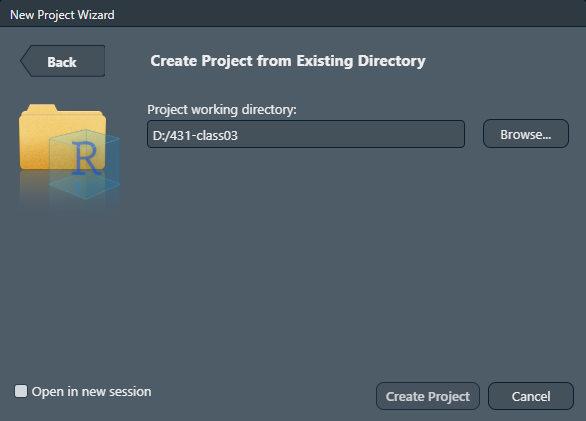

## I'm now using a 431-class03 project

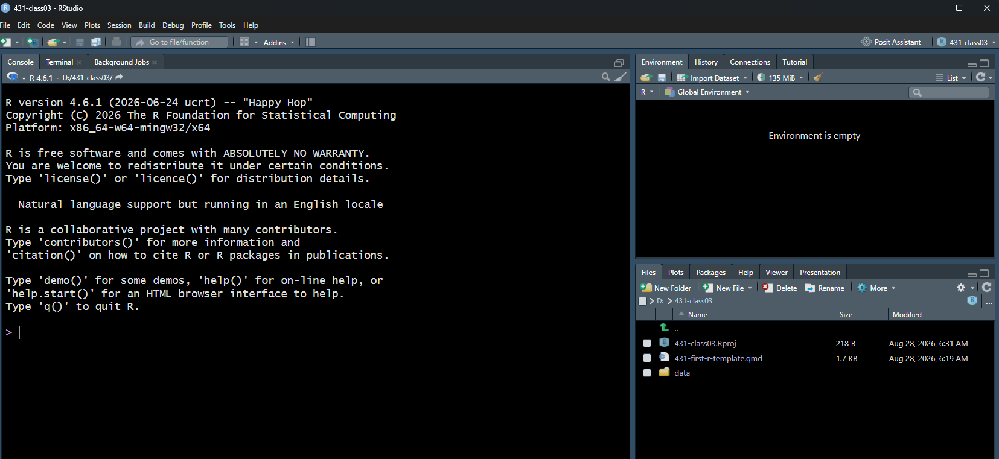

- Now, click to open 431-first-r-template.qmd

## 431-first-r-template.qmd

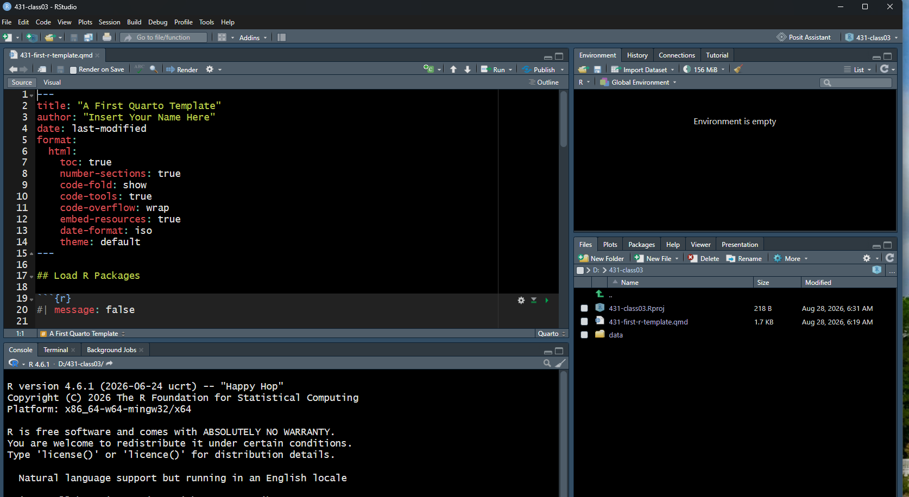

Save this file as class03_iris.qmd

## Personalize title and author

Now using class03_iris.qmd

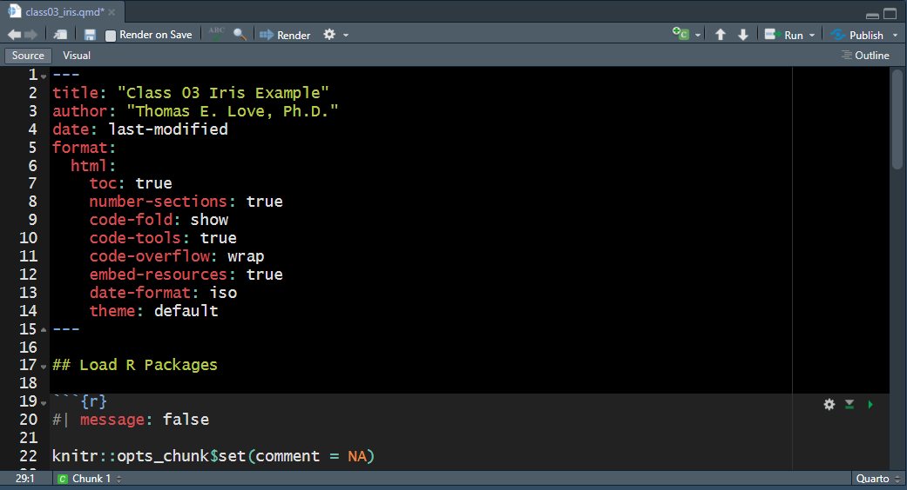

## Now hit Render to create HTML

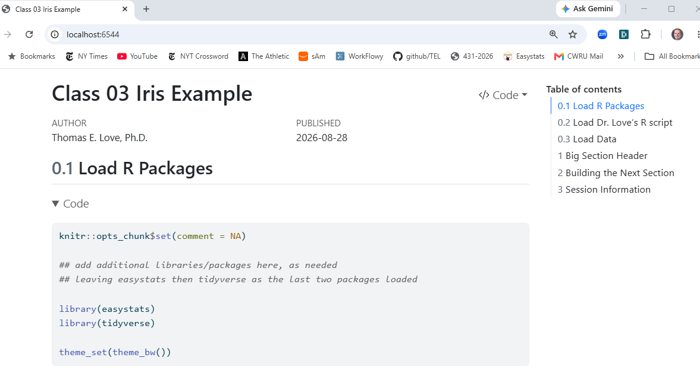

## Click to Section 1

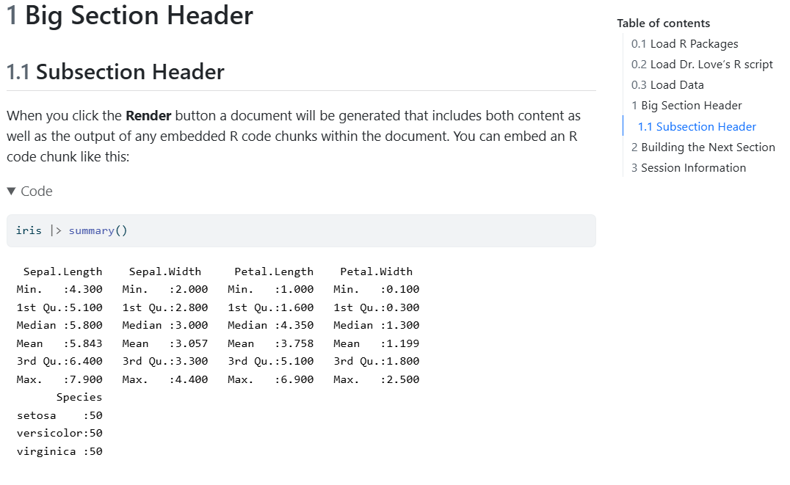

## Click to Section 2

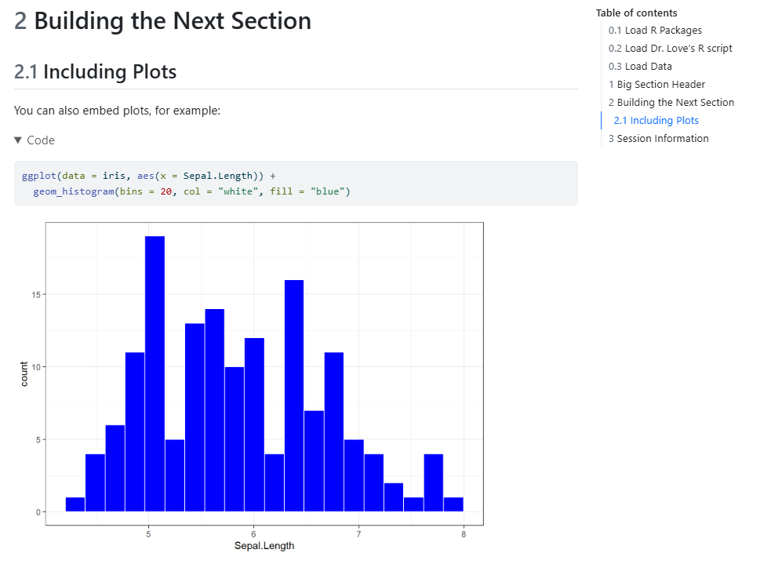

## OK, we'll start again 

1. Close the `class03_iris.qmd` example (saving your changes.)

2. Now open the `class03_toothgrowth_complete.qmd` file.
    - Feel free to change the title and author, if you like.

## Should look like this...

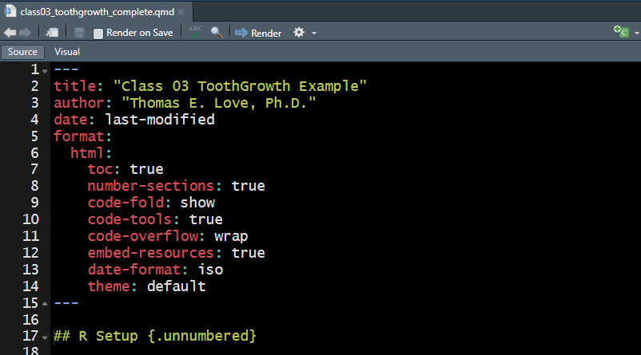

## Scroll down to see R Setup

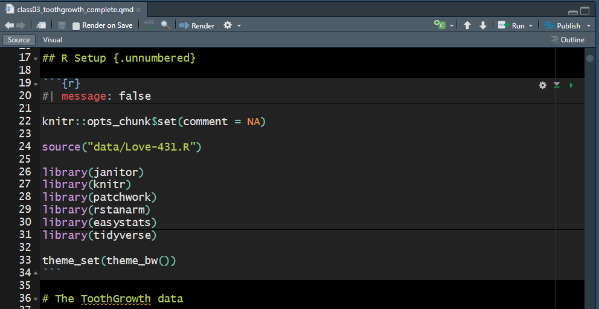

::: aside

`#| message: false` silences messages for this code chunk

:::

## Today's R Setup in the slides

```{r}
#| echo: true
#| message: false

knitr::opts_chunk$set(comment = NA)

source("c03/data/Love-431.R")

library(janitor)
library(knitr)
library(patchwork)
library(rstanarm)
library(easystats)
library(tidyverse)

theme_set(theme_bw())
```

## Today's R Setup (details)


- `knitr::opts_chunk$set(comment = NA)` sets an option that I prefer for how R's output is presented to us
- We've used the `source()` function to include some code I've written into an R script called `Love-431.R`. This includes a function called `lovedist()`.

## Loading R Packages

Loading packages in R is like opening up apps on your phone. We need to tell R that, in addition to the base functions available in the software, we also have other functions we want to use. 

- The `janitor` package has tools for examining, cleaning and tabulating data
- `knitr` includes the `kable()` function for pretty tables

## More on Today's R Setup 

- `patchwork` helps us combine plots
- `rstanarm` lets us fit Bayesian models
- The `easystats` meta-package contains several other packages that will help us (especially) with building models and presenting our results.
- It's helpful to load the `tidyverse` meta-package last. 

## The tidyverse meta-package

- We will use the series of packages called the `tidyverse` in every Quarto file we create.
    - The `tidyverse` was developed (in part) by Hadley Wickham, Chief Scientist at Posit (makers of RStudio).
    - `dplyr` for data wrangling, cleaning and transformation
    - `ggplot2` is our main visualization package
    - other `tidyverse` packages help import data, work with factors and other common activities.
    
`theme_set(theme_bw())` sets a theme I like for today's plots.

## The `ToothGrowth` data

:::: {.columns}

::: {.column width="70%"}

These data describe the length (`len`) of *odontoblasts* (cells responsible for tooth growth) in 60 guinea pigs.

- Each received one of three `dose` levels of vitamin C (0.5, 1 or 2 mg/day) 
- delivered (supplied) by either: 
    - `supp` = VC for ascorbic acid or
    - `supp` = OJ for orange juice
:::

:::{.column width = "25%"}

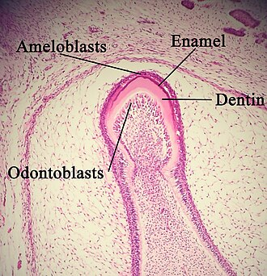

Photo: [Wikipedia](https://en.wikipedia.org/wiki/Odontoblast)

:::

::::

::: aside

I *think* the `len`gths are measured in micrometers (µm), also known as microns.

:::

## In class, you have two options...

1. Look at these slides, which include the code and some screenshots.
2. Render the `class03_toothgrowth_complete.qmd` and look at the HTML instead.

It's your choice.

## Show me the data...

```{r}
#| echo: true

ToothGrowth
```

## We prefer tibbles to data frames

```{r}
#| echo: true

TG_new <- ToothGrowth |> as_tibble()
TG_new
```

- Since `TG_new` is a *tibble*, printing it shows the first 10 rows and its dimensions and variable types...

## Using a tibble

After creating a *tibble* called `TG_new` with the ToothGrowth data, printing that *tibble* shows (only) the first 10 rows as well as the tibble's dimensions (number of rows and columns) and specifies the *type* of each variable.

- `<dbl>` means a double-precision decimal numeric value.
    - Sometimes numeric values can be integer type: `<int>`.
- Also, we see that the `supp` information is stored as a categorical `factor` (type = `<fct>`) in R.


## Exploring the Data

Here is a general numeric summary of our tibble.

```{r}
#| echo: true
summary(TG_new)
```

### Table of `supp` and `dose` counts

```{r}
#| echo: true
TG_new |> tabyl(supp, dose)
```

## Using `kable()` to neaten the table

Using `kable()` helps make the HTML a little prettier.

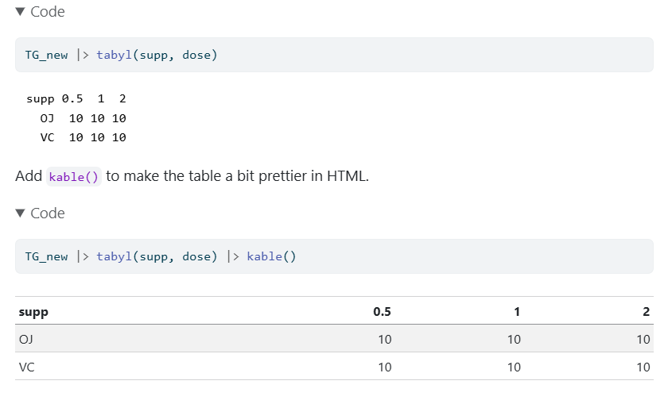

## Show the odontoblast lengths

Can we sort the lengths (`len`) from low to high?

```{r}
#| echo: true
sort(TG_new$len)
```

### Counting is wonderful

How many of the lengths are more than 20 microns?

```{r}
#| echo: true

TG_new |> count(len > 20)
```

## Filtering the data by row

Which subjects received doses of 1.0 mg/day via OJ?

```{r}
#| echo: true

TG_new |> filter(dose == 1, supp == "OJ")
```

## Some of my favorite summaries

```{r}
#| echo: true
TG_new |> reframe(lovedist(len)) 
```

- *n* = 60 observations, 
- *miss* = 0, so no missing data
- *mean* = "average" (sum of values / number of values)
- *med* = median (middle value when data are sorted)

## Some of my favorite summaries (2)

```{r}
#| echo: true
TG_new |> reframe(lovedist(len)) 
```

Measures of **spread** or variation:

- *sd* = standard deviation (formula in [our book](https://thomaselove.github.io/431-book/03_summary.html#mean-and-sd-median-and-mad))
- *mad* = median absolute deviation (formula in [our book](https://thomaselove.github.io/431-book/03_summary.html#mean-and-sd-median-and-mad))
- *min*, *max* = minimum and maximum value
- *q25*, *q75* = 25th and 75th quantiles (percentiles)

# We'll discuss [Project A](https://thomaselove.github.io/431-projectA-2026/) briefly after this *break*.{autoslide=120000}

## [Project A webpage](https://thomaselove.github.io/431-projectA-2026/) 

### Phases of the project

1. Read the instructions thoroughly. Work with partner?
2. Use the provided template and data to get started.
3. Finish data management to do Lab 4 (*2026-09-30*)
4. Finish four analyses before Quiz 1 (*2026-10-09*)
5. Project A due *2026-10-21* (day after Fall Break)
    - R **data** set, **Report**: both Quarto and HTML files
    - **Video** (max: 3 minutes), **Self-Evaluation** form

## ToothGrowth Summarizing `len`

```{r}
#| echo: true
TG_new |> select(len) |> describe_distribution(quartiles = TRUE)
```

- The definition of `IQR` = `q75` - `q25`, the interquartile range. 

::: aside

There are [9 different ways to calculate the quantiles](https://stat.ethz.ch/R-manual/R-devel/library/stats/html/quantile.html), and `describe_distribution()` unfortunately uses type 6 for IQR and type 7 (the default) for quartiles.

```{r}
#| echo: true
quantile(TG_new$len, c(0.25,0.75), type = 6); quantile(TG_new$len, c(0.25,0.75), type = 7)
```

:::

## Histogram of odontoblast lengths

- HTML result shown on next slide.

```{r}
#| echo: true
#| message: true
ggplot(data = TG_new, aes(x = len)) +
  geom_histogram()
```

## HTML of Histogram, version 1

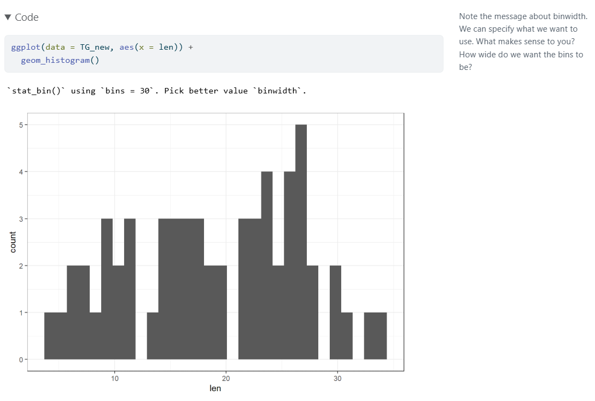

## Version 2: set bin width and colors

```{r}
#| echo: true
ggplot(data = TG_new, aes(x = len)) +
  geom_histogram(binwidth = 1, fill = "navy", col = "yellow") 
```

## HTML of Histogram, version 2

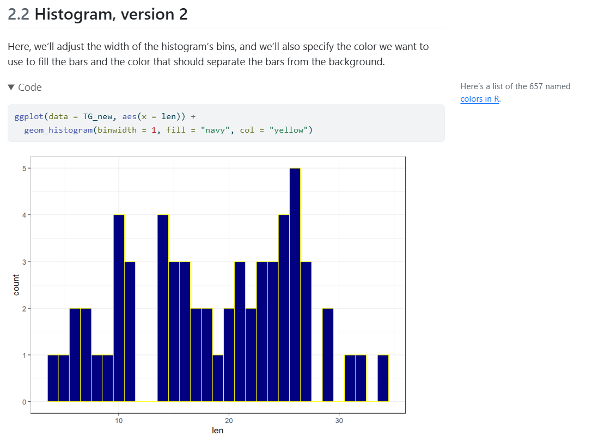

## Version 3: try 10 bins, set labels

```{r}
#| echo: true
ggplot(data = TG_new, aes(x = len)) +
  geom_histogram(bins = 10, fill = "navy", col = "yellow") +
  labs(title = "Odontoblast lengths for 60 guinea pigs",
       x = "Odontoblast length", y = "Number of animals") 
```

## Estimating the mean `len`

- We’ll fit a linear regression model using ordinary least squares (OLS) with `lm()`.

```{r}
#| echo: true

fit1 <- lm(len ~ 1, data = TG_new)
model_parameters(fit1, ci = 0.95)
```

- Our linear model for the mean odontoblast length provides a point estimate (sample mean) of 18.81 with a 95% confidence interval ranging from 16.84 to 20.79.

## How is dose related to length?

The guinea pigs were randomly allocated to receive one of three doses:

- 0.5 mg/day
- 1.0 mg/day
- 2.0 mg/day

with 20 animals at each `dose`.

- How can we picture the relationship between `dose` and odontoblast length (`len`)?

## Plotting `len` by `dose`?

```{r}
#| echo: true

ggplot(TG_new, aes(x = dose, y = len)) +
  geom_point()
```

## Treat `dose` as a categorical *factor*

```{r}
#| echo: true

ggplot(TG_new, aes(x = factor(dose), y = len)) +
  geom_violin(fill = "tan") +
  geom_point()
```

## Add boxplots, sample means

```{r}
#| echo: true

ggplot(TG_new, aes(x = factor(dose), y = len)) +
  geom_violin(fill = "tan") +
  geom_boxplot(aes(width = 0.2)) +
  stat_summary(fun = mean, geom = "point", size = 3, col = "red") 
```

## Numerical summary (`len` by `dose`)

```{r}
#| echo: true
TG_new <- TG_new |> mutate(dose_f = as_factor(dose))

TG_new |> reframe(lovedist(len), .by = dose_f)
```

- When assessing the *center* of these distributions, should we use a mean or a median or does it not really matter?
- How might we assess the *spread*/range/variation?
- How about the *shape* of the data?

## Length and `supp`ly method

- What should this look like, based on the code?
    - Plot shown on next slide...

```{r}
#| echo: true
#| output-location: slide
ggplot(TG_new, aes(x = supp, y = len)) +
    geom_violin() +
    geom_boxplot(aes(fill = supp, width = 0.2)) +
    stat_summary(fun = mean, geom = "point", size = 3, col = "black") +
    scale_fill_metro(palette = "light", reverse = TRUE) +
    labs(title = "Comparing odontoblast length by supply method",
         subtitle = "60 guinea pigs: The ToothGrowth data",
         x = "Method of Supply (Orange Juice (OJ) or Ascorbic Acid (VC))",
         y = "Odontoblast length")
```

## Lengths within each supply method

```{r}
#| echo: true

TG_new |> group_by(supp) |> 
    reframe(lovedist(len)) 
```

## Estimate Difference in Means with Confidence Interval?

We'll fit a linear regression model using ordinary least squares (OLS) to build one possible confidence interval.

```{r}
#| echo: true
fit2 <- lm(len ~ (supp == "OJ"), data = TG_new)

model_parameters(fit2, ci = 0.95)
```

Our model for the difference in mean length suggests that the OJ animals had odontoblasts that were 3.7 μm longer, with 95% confidence interval -0.17 to 7.57 μm.

## What if we don't specify `supp == "OJ"`?

Notice the change when we fit the model without specifying the direction of effect that interests us.

```{r}
#| echo: true
fit2_revised <- lm(len ~ supp, data = TG_new)

model_parameters(fit2_revised, ci = 0.95)
```

- Previous slide: OJ were 3.7 μm longer (95% CI: -0.17, 7.57).

## Consider both `dose` and `supp`

The guinea pigs were randomly allocated so that we have 10 animals at each combination of one of the three `dose`s and one of the two `supp`s.

- How does the relationship we observed between `dose` and odontoblast length (`len`) change when we take into account the `supp` method?

## Summarizing `len` by `dose` and `supp`

```{r}
#| echo: true

TG_new |> group_by(dose_f, supp) |> 
  reframe(lovedist(len))
```

Boxplots of `len` in each `dose`, now separated (faceted) by `supp`...

## Impact of `dose` *and* `supp`?

Result of adding the `facet_wrap()` line: next slide...

```{r}
#| echo: true
#| output-location: slide

ggplot(TG_new, aes(x = dose_f, y = len)) +
  geom_violin(fill = "tan") +
  geom_boxplot(aes(width = 0.2)) +
  stat_summary(fun = mean, geom = "point", size = 3, col = "red") +
  facet_wrap(~ supp, labeller = "label_both")
```


## Length by supply, facets by dose?

```{r}
#| echo: true
#| output-location: slide

ggplot(TG_new, aes(x = supp, y = len)) +
  geom_violin() +
  geom_boxplot(aes(fill = supp, width = 0.2)) +
  stat_summary(fun = mean, geom = "point", size = 3, col = "white") +
  facet_wrap(~ dose_f, labeller = "label_both") +
  scale_fill_metro(palette = "light", reverse = TRUE) +
  labs(title = "Comparing Length by Supply Method, by dose",
       subtitle = "Vitamin C experiment in Tooth Growth of 60 guinea pigs",
       x = "Supply Method", y = "Odontoblast length",
       caption = "Sample means shown as white dots.")
```

## Recap: What Have We Done?

1. Created an R Project to house our work
2. Altered a Quarto template to do what we want
3. Rendered the Quarto file to create HTML
4. R packages and other R setup
5. Tibble with `as_tibble()`, `<-` (assignment), `|>` (pipe) 
6. Numerical and tabular summaries
7. Visualizations (histograms and boxplots)
8. Estimating confidence intervals for one mean, or comparing two means, using a linear model

## Next Time

- Data from the 15-item survey in Class 2
    - Ingesting data from the internet via `.csv`
    - Data Management and 6 key verbs in tidyverse
    - Visualization, Modeling, Inference tools
    - Exploring the data
    - Asking and answering some questions
- Making sure you're ready for Lab 1 (due 2026-09-09)

::: aside

Please don't forget to do the **Minute Paper after Class 3.**

:::

## Session Information

```{r}
#| echo: true
xfun::session_info()
```
