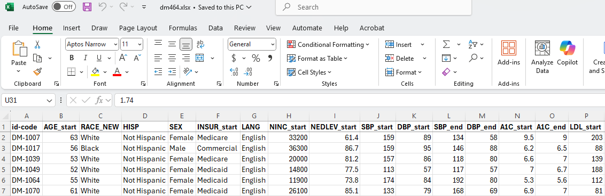

## Today's Agenda {.smaller}

- The `dm464` study
  - Data stored in an Excel spreadsheet, rather than a `.csv` file
  - Data on 464 adults with diabetes between the ages of 18 and 73
- Estimating the Difference between Two Population Means
  - when our samples are paired
  - when our samples are independent
- Comparisons and estimates built using 
  - ordinary least squares linear models (and their t-based equivalents), 
  - the bootstrap, and 
  - Bayesian linear models
- Chapters 5-6 of [Dr. Love's book](https://thomaselove.github.io/431-book/) have more.

## Load packages and set theme

```{r}
#| echo: true
#| message: false

knitr::opts_chunk$set(comment = NA)
source("c05/data/Love-431.R") # for the lovedist() function

library(janitor)
library(patchwork)
library(rstanarm)

library(readxl)     ## new today
library(knitr)      ## new (sort of) today
library(kableExtra) ## new today
library(ggdist)     ## new today
library(MKinfer)    ## new today

library(easystats)
library(tidyverse)

theme_set(theme_bw())
```

# Managing the `dm464` Data

## Today's data (`dm464.xlsx`)

The data describe a cohort of 464 adults measured in a one-year baseline window, and then again in a similar window two years after baseline. 

- The data in `dm464` are simulated, but mirror real data gathered by [Better Health Partnership](https://www.betterhealthpartnership.org/).
- The `dm464` data are restricted to people ages 18-73 at baseline, with a diabetes diagnosis who spoke English as their primary language, who lived in Cuyahoga County, and for whom multiple primary care visits were observed in the baseline and follow-up periods. 

## Data are in an Excel Sheet

- Stored in an Excel worksheet called `dm464.xlsx`, rather than in a `.csv` file.



## Pulling in the `dm464` data

Ingest the data with `read_xlsx()` from **readxl** package^[Excel file downloaded to the `c05/data` subdirectory of my R project directory.].

```{r}
#| echo: true

dm464_raw <- read_xlsx("c05/data/dm464.xlsx")
dim(dm464_raw)
names(dm464_raw)
```

## Auto-cleaning variable names

```{r}
#| echo: true

dm464 <- dm464_raw |> janitor::clean_names()

names(dm464)
```

- Here's a nice [overview of janitor functions](https://cran.r-project.org/web/packages/janitor/vignettes/janitor.html). By default, names are parsed to `snake_case` but other options exist.

## Today's Seven Variables

Variable | Definition
-----: | :--------------------------------------------
`id_code` | Subject Code (unique for each row)
`age_start` | baseline age, in years
`sex` | Female or Male
`a1c_start` | baseline Hemoglobin A1c, %
`a1c_end` | Hemoglobin A1c at study end, %
`ldl_start` | baseline LDL cholesterol, mg/dl
`statin_start` | baseline: Statin prescribed? (1 or 0)

## Select (and Rename) Variables

Let's select our variables, and simplify some names.

```{r}
#| echo: true
class05 <- dm464 |>
  select(id_code, age = age_start, sex, a1c_base = a1c_start, 
         a1c_end, ldl = ldl_start, statin = statin_start)

str(class05)
```

## Change characters to factors

- The `sex` variable is listed as character, but we'd like it instead to be represented as a *factor*.
    - The `id_code` should remain as a character variable.
- We'll also add a factor version of the `statin` variable (`stat_f` is binary: with 1 = statin, and 0 = no)

```{r}
#| echo: true

class05 <- class05 |> 
  mutate(sex = as_factor(sex)) |>
  mutate(stat_f = fct_recode(as_factor(statin), "statin" = "1", "no" = "0"))
```

## Checking our work

- Do the `stat_f` and `statin` variables agree?

```{r}
#| echo: true
class05 |> count(statin, stat_f)
```

- Do we have a different `id_code` in each row?

```{r}
#| echo: true
nrow(class05)
class05 |> select(id_code) |> n_distinct()
```

## Missingness? Range checks? Types?

```{r}
#| echo: true

summary(class05)
```

- Revised "codebook" on next slide

## 

Variable | Definition (`class05` tibble)
-----: | :--------------------------------------------
`id_code` | subject code
`age` | baseline age, in years
`sex` | Female or Male
`a1c_base` | baseline Hemoglobin A1c, %
`a1c_end` | Hemoglobin A1c at study end, %
`ldl` | baseline LDL cholesterol, mg/dl
`statin` | baseline: Statin prescribed? (1 or 0)
`stat_f` | `statin` as factor (1 = `statin`, 0 = `no`)

## Our `class05` analytic tibble

```{r}
#| echo: true

class05
```

## Saving and Loading a tibble

We can save the `class05` tibble to a file, for instance ...

```{r}
#| echo: true

write_rds(class05, "c05/data/class05.Rds")
```

which we can then reload whenever we like with ...

```{r}
#| echo: true

class05_read <- read_rds("c05/data/class05.Rds")

identical(class05, class05_read)
```

# Six Key "Verbs" for Data Management

## 6 key data management "verbs"

- `filter()` chooses rows
- `select()` chooses columns
- `arrange()` sorts rows by values
- `mutate()` creates new columns
- `group_by()` manipulates groups of data
- `summarize()` provides numerical summaries

All of these are in the `dplyr` package; part of the **tidyverse**. See the [Data Transformation chapter of R4DS](https://r4ds.hadley.nz/data-transform.html).

## `filter()`

We use the `filter()` function to change which rows are present in the data, without changing the order.

```{r}
#| echo: true
class05 |> filter(sex == "Female", age < 30)
```

## `select()`

We use the `select()` function to change which columns are present...

```{r}
#| echo: true

class05 |> select(id_code, a1c_base, a1c_end)
```

## `arrange()`

We use `arrange()` to change the order of the rows based on their values.

```{r}
#| echo: true
class05 |> arrange(a1c_base) |> 
  select(id_code, a1c_base, a1c_end)
```

## `mutate()`

We use `mutate()` to add new columns calculated from the existing columns.

```{r}
#| echo: true
class05 |> select(id_code, a1c_base, a1c_end) |>
  mutate(a1c_change = a1c_end - a1c_base)
```

## `group_by()` and `summarize()`

We use `group_by()` to divide the data in groups of interest then use `summarize()` to obtain summaries.

```{r}
#| echo: true
class05 |> select(id_code, sex, a1c_base, a1c_end) |>
  mutate(a1c_change = a1c_end - a1c_base) |>
  group_by(sex) |> summarize(n = n(), median = median(a1c_change)) 
```

::: aside

We've used this `group_by()` approach, with `lovedist()`, too.

:::

## Today's Analytic Questions

We'll use the `class05` tibble to address these two questions...

1. How large is the difference in the mean Hemoglobin A1c level at baseline as compared to the A1c level in the follow-up period?

2. How large is the difference in the mean LDL cholesterol level at baseline for people who have a statin prescription at baseline, as compared to those who don't?

# Comparing Means

## Paired Samples Comparisons

Suppose we want to compare the weights of mice: 

- **before** they are switched to a new diet, vs.
- **after** they have been on the new diet for 2 weeks

In our sample of (say) 100 mice, each mouse provides a *pair* of measurements, and we can calculate the change in weight for each mouse:

mouse | before | after | change 
---- | :---------: | :---------: | :---------:
A-001 | 14 | 16 | 2
A-002 | 18 | 17 | -1

## Paired Samples and our Mice

We want to make estimates using data on those 100 changes in weight to describe what might happen in a larger population of mice who switched diets.

- Each mouse's "before" and "after" data, then, describes two *paired* samples.

We compare means (or other summaries) using paired samples whenever data are gathered so that the responses from the two groups being compared (here, before and after) are paired (or matched.)

## Independent Samples

Suppose we want to compare the weights of mice who are on diet A, vs. mice who are on diet B.

We sample 50 mice on diet A and 50 different mice on diet B^[Maybe we started with 100 mice, and randomly assigned 50 to each diet.]. Each mouse provides a weight after their selected diet, and there is no pre-planned pairing of individual diet A mice to diet B mice.

mouse | diet | weight 
---- | :---------: | :---------: 
A-101 | A | 18
B-102 | B | 15

## Independent Samples & Mice

We then make estimates using the weights of all 100 sampled mice to describe what might happen in a larger population comparing diet A to B.

- Each mouse provides an "A" or "B" weight, and the samples are not paired, but rather *independent*.

We compare means (or other summaries) using independent samples whenever we have data gathered so that the responses from the two groups being compared (here, A and B) are **not** paired (or matched.)

# Question 1

## Comparing `a1c_base` to `a1c_end`

1. How large is the difference in the mean Hemoglobin A1c level at baseline as compared to the A1c level in the follow-up period?

We are comparing each subject's `a1c_base` to their `a1c_end`, to learn what our sample might tell us about the mean of those differences.

- Does this planned analysis make use of paired samples or independent samples?
    - What do you think?

## Paired or Independent Samples?

Does this planned analysis make use of paired samples or independent samples?

::: {.incremental}

- Each subject provides an `a1c_base` as well as an `a1c_end`.
- Calculating the difference (`a1c_end` - `a1c_base`) makes sense for each individual subject.
- This will leave us with $n = 464$ paired differences to study.

:::

## Paired A1c samples...

- How are the samples paired?

```{r}
#| echo: true

class05 |> select(id_code, a1c_base, a1c_end)
```


## Build the paired A1c differences

```{r}
#| echo: true
class05 <- class05 |>
  mutate(a1c_diff = a1c_end - a1c_base)

class05 |> reframe(lovedist(a1c_diff))
```

Could also use `summary()`, `fivenum()`, `describe_distribution()`, `mean_sd`, `median_mad`, `summarize()`, etc. to obtain various numerical summaries in this case.

## Make a prettier table?

Using the **knitr** package...

```{r}
#| echo: true

class05 |> reframe(lovedist(a1c_diff)) |> 
  kable(digits = 2)
```

or, using the **knitr** and **kableExtra** packages...

```{r}
#| echo: true

class05 |> reframe(lovedist(a1c_diff)) |> 
  kable(digits = 2) |> kable_styling(font_size = 28) 
```

## Standard Deviation (`sd` in R) {.smaller}

- Find the mean of the $n$ observations in your data, $\bar{x}$.
- Find the squared difference between each data point $x_i$ and the mean $\bar{x}$.
- Sum these squared differences.
- Divide the sum by $n-1$.
- This gives the **variance**.
- The square root of the variance is the **standard deviation**.

$$
s = \sqrt{\frac{\sum_{i=1}^{n}{(x_i - \bar{x})^2}}{n-1}}
$$

- The standard deviation is more often used to measure variation than the variance because the standard deviation has the same units of measurement as the mean.

## Median Absolute Deviation {.smaller}

The median absolute deviation (MAD) is the median of the absolute deviations from the sample median, so if $x_{med}$ is the sample median of a set of $n$ observations, the MAD is:

$$
MAD = median(|x_i - x_{MED}|) \times 1.4826
$$

- The purpose of multiplying by the constant is so that if data come from a Normal distribution, the MAD (with this multiplication) and the standard deviation will have the same value.
- See [Appendix E of Dr. Love's Course Book](https://thomaselove.github.io/431-book/formulas.html) for detailed descriptions of key summaries.

## DTDP: Paired A1c differences

```{r}
#| echo: true
ggplot(data = class05, aes(x = a1c_diff)) +
  geom_histogram(bins = 20, fill = "#002D72", col = "#FF5910") +
  labs(title = "Paired difference in A1c (end - baseline)",
       subtitle = "n = 464 subjects",
       x = "Difference in A1c (end - baseline)", y = "Subjects")
```

## What does the distribution of A1c differences look like? (1/4)

- Plot `p1` - Histogram with superimposed Normal curve

```{r}
#| echo: true

bw = 1 # specify width of bins in histogram

p1 <- ggplot(class05, aes(x = a1c_diff)) +
  geom_histogram(binwidth = bw, fill = "black", col = "yellow") +
  stat_function(fun = function(x) 
    dnorm(x, mean = mean(class05$a1c_diff, na.rm = TRUE), 
          sd = sd(class05$a1c_diff, na.rm = TRUE)) * 
          length(class05$a1c_diff) * bw,
    geom = "area", alpha = 0.5, 
    fill = "lightblue", col = "blue") +
  labs(x = "A1c difference (%)", y = "Count",
       title = "Histogram & Normal Curve")
```

## What does the distribution of A1c differences look like? (2/4)

- Plot `p2` - Normal Q-Q plot

```{r}
#| echo: true

p2 <- ggplot(class05, aes(sample = a1c_diff)) +
  geom_qq() + geom_qq_line(col = "red") +
  labs(y = "A1c difference (%)", x = "Standard Normal Distribution",
    title = "Normal Q-Q plot")
```

## What does the distribution of A1c differences look like? (3/4)

- Plot `p3` - Boxplot with violin and mean

```{r}
#| echo: true

p3 <- ggplot(class05, aes(x = a1c_diff, y = "")) +
  geom_violin(fill = "cornsilk") +
  geom_boxplot(width = 0.2) +
  stat_summary(fun = mean, geom = "point", shape = 16, col = "red") +
  labs(y = "", x = "A1c difference (%)", title = "Boxplot with Violin")
```

## Shape of the distribution? (4/4)

- Use the patchwork package to combine plots `p1`, `p2` and `p3` into a single figure
- See [section 2.4.6 in our Course Book](https://thomaselove.github.io/431-book/02_viz.html#three-plots-at-once) for similar "Three Plots At Once" code.

```{r}
#| echo: true
#| output-location: slide

p1 + 
  (p2 / p3 + plot_layout(heights = c(2, 1))) +
  plot_annotation(title = "class05: Differences in A1c")
```

## Summaries of A1c differences

OK, so the distribution of A1c differences looks symmetric, but outlier-prone relative to a Normal distribution.

- Let's look again at our numerical summaries...

```{r}
#| echo: true

class05 |> reframe(lovedist(a1c_diff)) |> 
  kable(digits = 2) |> 
  kable_styling(font_size = 28)
```

- What does the sample mean (0.33) suggest in this context?

# Standing Break

## Estimating the Mean Difference

We'll demonstrate three ways to estimate the population mean difference in A1c, and form a **90% uncertainty interval** using these paired samples^[[Chapter 5 of Dr. Love's book](https://thomaselove.github.io/431-book/05_paired.html) has more details and examples.].

- Ordinary least squares regression model (equivalent to a paired t procedure here) fit with `lm()`.
- Bayesian regression model with a weakly informative prior, fit with `stan_glm()` from **rstanarm**.
- Bootstrap confidence interval for the mean difference, fit with `boot.t.test()` from **MKinfer**.

## Using `lm()` to fit an OLS model

```{r}
#| echo: true

fit1 <- lm(a1c_diff ~ 1, data = class05)

model_parameters(fit1, ci = 0.90, pretty_names = FALSE)
```

- Sample mean difference is 0.33, with 90% uncertainty interval (0.20, 0.47).
- All three of these summaries are positive numbers. What does that indicate?

## Paired t approach = same as OLS

- Note that here we must include `conf.level = 0.90` within the `t.test()` command and `ci = 0.90` in the call to `model_parameters()` in order to get the right (90%) uncertainty interval.

```{r}
#| echo: true

fit2 <- t.test(class05$a1c_diff, conf.level = 0.90)
model_parameters(fit2, ci = 0.90, pretty_names = FALSE)
```

## Bayesian fit

Bayesian inference is an excellent choice for virtually every regression model, even when using **weakly informative default priors** (as we will do in 431), because it yields estimates which are stable, and because it helps present uncertainty in useful ways.

```{r}
#| echo: true

set.seed(43101)
fit3 <- stan_glm(a1c_diff ~ 1, data = class05, refresh = 0)
model_parameters(fit3, ci = 0.90, pretty_names = FALSE)
```

## The bootstrap (with `MKinfer`)

```{r}
#| echo: true

set.seed(43102)
boot.t.test(class05$a1c_diff, conf.level = 0.90, R = 2000)
```

## 90% Uncertainty Intervals

Estimating the mean of the paired differences in Hemoglobin A1c levels from baseline to study end...

Approach | Estimate & 90% Interval
:-------------------------------------: | :------------:
Linear model / Paired t | 0.33 (0.20, 0.47)
Bayesian fit: `stan_glm()` | 0.33 (0.20, 0.47)
Bootstrap: `boot.t.test()` | 0.33 (0.197, 0.476)

- Do our conclusions change here?

## Are our paired A1c values correlated? 

- Here, we see a meaningful and positive correlation between the paired A1c values, suggesting that the pairing helped to reduce nuisance variation.

```{r}
#| echo: true

class05 |> select(a1c_base, a1c_end) |> correlation()
```

# Question 2

## Comparing `ldl` by `statin` level

We'll build a boxplot, including violins and means.

```{r}
#| echo: true
#| output-location: slide

ggplot(class05, aes(x = ldl, y = stat_f, 
                fill = stat_f)) +
  geom_violin() +
  geom_boxplot(width = 0.3, fill = "white") +
  stat_summary(fun = mean, geom = "point", shape = 16, size = 3,
               col = "red") +
  scale_fill_viridis_d(alpha = 0.3) +
  guides(fill = "none") +
  labs(title = "LDL by Statin Prescription Status",
       x = "Most recent LDL in the baseline period, in mg/dl", 
       y = "Statin Prescription at end of baseline period")
```

## Rain Cloud Plot

This plot includes `stat_slab()` and `stat_dotsinterval()` from the **ggdist** package.

```{r}
#| echo: true
#| output-location: slide

ggplot(class05, aes(y = stat_f, x = ldl, fill = stat_f)) +
  stat_slab(aes(thickness = after_stat(pdf * n)), scale = 0.7) +
  stat_dotsinterval(side = "bottom", scale = 0.7, 
                    slab_linewidth = NA) +
  scale_fill_viridis_d(alpha = 0.7, begin = 0.2) +
  guides(fill = "none") +
  labs(title = "LDL by Statin Prescription Status",
       x = "Most recent LDL in the baseline period, in mg/dl", 
       y = "Statin Prescription at end of baseline period")
```

## Faceted Histograms

```{r}
#| echo: true

bw = 5
ggplot(class05, aes(x = ldl)) + 
  geom_histogram(binwidth = bw, fill = "navy", col = "white") + 
  facet_wrap(~ stat_f) +
  labs(x = "LDL at baseline", y = "Counts", 
       title = "LDL by Statin Status")
```

## Faceted Normal Q-Q plots

```{r}
#| echo: true

ggplot(class05, aes(sample = ldl)) + 
  geom_qq() + geom_qq_line(col = "purple") + 
  facet_wrap(~ stat_f) +
  labs(x = "Standard Normal distribution", y = "LDL at baseline")
```

## Comparing `ldl` by `statin` level

- LDL data in each statin group are skewed to the right, with the mean higher than the median. 

```{r}
#| echo: true
class05 |> group_by(stat_f) |> reframe(lovedist(ldl)) |>
  kable(digits = 1) |> kable_styling(font_size = 28)
```

- Were these data collected using matched/paired samples or using independent samples?

## Estimating Difference in Means

Building **90%** uncertainty intervals for the difference in population means using independent samples^[[Chapter 6](https://thomaselove.github.io/431-book/06_twogroups.html) has more details and examples.].

- Ordinary least squares regression model (same as a pooled t procedure here) fit with `lm()`.
- Bayesian regression model with a weakly informative prior fit with `stan_glm()` from **rstanarm**.
- Welch t method without pooling standard deviations.
- Bootstrap confidence interval approach.

## Using `lm()` to fit an OLS model

```{r}
#| echo: true

fit4 <- lm(ldl ~ stat_f, data = class05)

model_parameters(fit4, ci = 0.90, pretty_names = FALSE)
```

- Comparing those on a statin to those that aren't, our model suggests that the mean difference in LDL levels is 7.17 mg/dl with 90% uncertainty interval (0.02, 14.32) mg/dl.


## Pooled t = same as OLS

```{r}
#| echo: true

fit5 <- t.test(ldl ~ stat_f, data = class05, 
               var.equal = TRUE, conf.level = 0.90)

model_parameters(fit5, ci = 0.90, pretty_names = FALSE) 
```

## Bayesian regression model

```{r}
#| echo: true

set.seed(43103)

fit6 <- stan_glm(ldl ~ stat_f, data = class05, refresh = 0)

model_parameters(fit6, ci = 0.90, pretty_names = FALSE)
```

## Welch t approach (no pooling)

```{r}
#| echo: true

fit7 <- t.test(ldl ~ stat_f, data = class05, 
               var.equal = FALSE, conf.level = 0.90)

model_parameters(fit7, ci = 0.90, pretty_names = FALSE)  
```

## Bootstrap, with `MKinfer`

```{r}
#| echo: true

set.seed(43104)
boot.t.test(ldl ~ stat_f, var.equal = TRUE, R = 2000,
  data = class05, conf.level = 0.90)
```

## Bootstrap without pooling sd

```{r}
#| echo: true

set.seed(43105)
boot.t.test(ldl ~ stat_f, var.equal = FALSE, R = 2000,
  data = class05, conf.level = 0.90)
```

## 90% Uncertainty Intervals

Mean difference in baseline LDL for "Statin" group minus "No Statin" group. Do our conclusions change?

Approach | Estimate & 90% Interval
:---------------------------------: | :----------------------:
Linear model / Pooled t | 7.17 (0.02, 14.32)
Bayesian fit: `stan_glm()` | 7.07 (-0.26, 14.08)
Welch t (unpooled sd) | 7.17 (0.86, 13.48)
Bootstrap, pooled sd | 7.25 (0.18, 14.28)
Bootstrap, unpooled sd | 7.06 (0.87, 13.00)

## Session Information

```{r}
#| echo: true
xfun::session_info()
```
