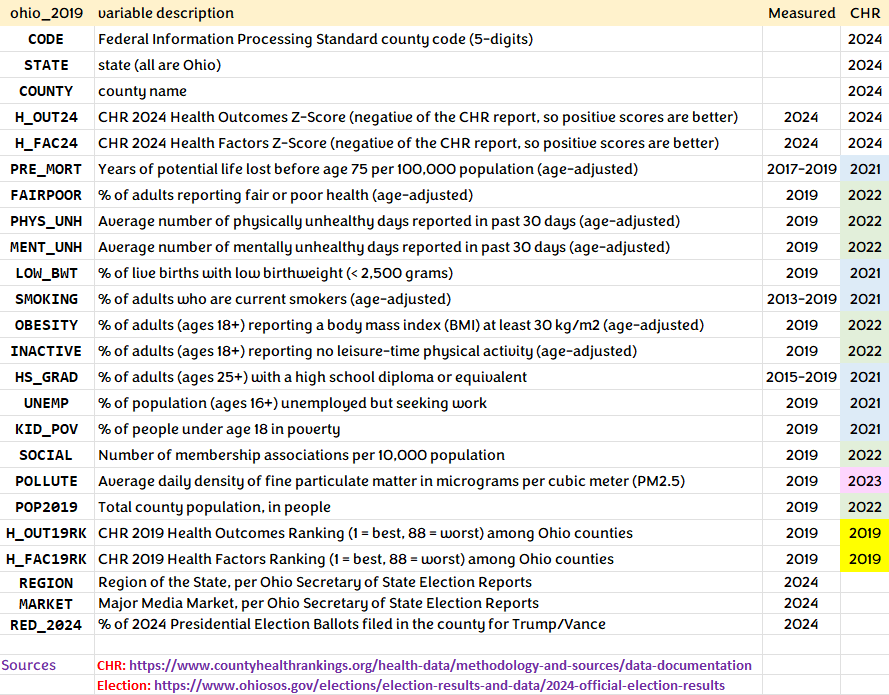
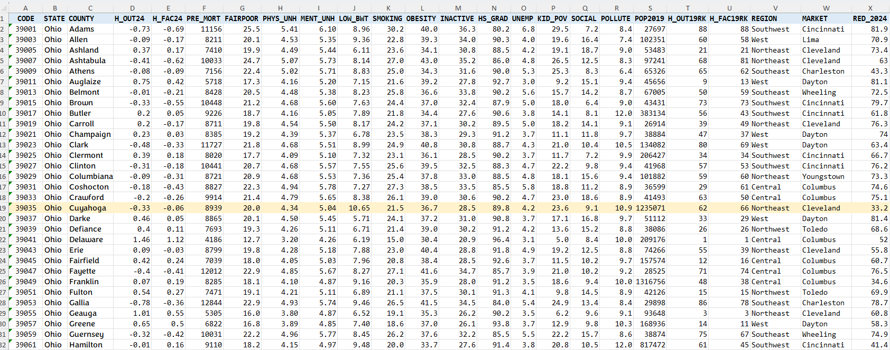

## Today's Agenda

- Data from Class 07: Ohio's 88 Counties
- One-Factor Analysis of Variance (ANOVA)
  - Using Regression to Develop an ANOVA model
  - Methods for multiple pairwise comparisons
  - Checking ANOVA Model Assumptions
  - Bayesian fitting of an ANOVA model
- Favorite Movies: Discussion 1


## Load packages and set theme

```{r}
#| echo: true
#| message: false

library(janitor)
library(patchwork)
library(readxl)
library(MKinfer)
library(rstanarm)
library(DescTools)  ## new: used for Bonferroni         
library(easystats)
library(tidyverse)

theme_set(theme_bw())
knitr::opts_chunk$set(comment = NA)

source("c08/data/Love-431.R") # for the lovedist() function
```

# Get the data

## `ohio_2019.xlsx` codebook



## Data Ingest from Class 07

```{r}
#| echo: true

oh19 <- read_xlsx("c08/data/ohio_2019.xlsx") |>
  janitor::clean_names()
```



## Creating `ohio_8` from `oh19`

```{r}
#| echo: true
ohio_8 <- oh19 |>
  dplyr::select(code, county, h_out24, h_fac19rk) |>
  mutate(hfactor = case_when(
    h_fac19rk <= 22 ~ "Best",
    h_fac19rk > 22 & h_fac19rk <= 44 ~ "High",
    h_fac19rk > 44 & h_fac19rk <= 66 ~ "Low",
    h_fac19rk > 66 ~ "Worst")) |>
  mutate(hfactor = fct_relevel(factor(hfactor), 
             "Worst", "Low", "High", "Best")) |>
  mutate(across(where(is.character), as_factor)) |>
  mutate(county = as.character(county),
         code = as.character(code)) |>
  droplevels()
```

## `ohio_8` tibble

```{r}
#| echo: true

ohio_8
```

## Key Variables from `ohio_8`

- `h_out24` = CHR 2024 Health Outcomes Score^[The CHR Health Outcomes score includes measures of length of life and quality of life. More positive results here are better (opposite of CHR's scale.)]
- `hfactor` = 4-level factor (Worst, Low, High, Best) grouped by CHR 2019 Health Factors Score^[The CHR Health Factors score includes measures of health behaviors, clinical care, social and economic factors, and the physical environment.]
- `county` name and FIPS `code` used as identifiers

## Today's Question

How large is the mean difference in 2024 Health Outcomes scores across the four groups of Ohio counties defined by their 2019 Health Factors rankings?

```{r}
#| echo: true
#| output-location: slide
ggplot(ohio_8, aes(x = hfactor, y = h_out24)) +
  geom_violin(aes(fill = hfactor)) + 
  geom_boxplot(width = 0.2, fill = "white") +
  stat_summary(fun = mean, geom = "point", 
               size = 2, col = "red") +
  scale_fill_viridis_d(option = "plasma", alpha = 0.4) +
  guides(fill = "none") +
  labs(x = "CHR 2019 Health Factors Group",
       y = "CHR 2024 Health Outcomes Score",
       title = "Comparing Four Independent Samples") 
```

## Numerical Summary

```{r}
#| echo: true

ohio_8 |> group_by(hfactor) |> reframe(lovedist(h_out24))
```

- Do we have a **balanced design**?
- Any **extreme skew** or **massive outlier issues** in plot?
- Shall we try an Analysis of Variance (ANOVA) model?

# ANOVA: Indicator Variable Regression

## Indicator Variable Regression

```{r}
#| echo: true

fit1 <- lm(h_out24 ~ hfactor, data = ohio_8) ## fitting the model
round_half_up(coef(fit1),4) ## rounded off regression coefficients
```

:::{.callout-tip}
### What does our `fit1` model predict for each `hfactor` group?

Predicted `h_out24` = 
-0.5132 + 0.4132 (Low) + 0.8095 (High) + 1.1959 (Best)

- so our prediction for Worst (to three decimal places) is -0.513
- for Low is -0.5132 + 0.4132 = -0.100
- for High is -0.5132 + 0.8095 = 0.296
- for Best is -0.5132 + 1.1959 = 0.683

Note that these are also the observed group means of `h_out24`.
:::

## The ANOVA table

```{r}
#| echo: true

fit1 <- lm(h_out24 ~ hfactor, data = ohio_8)
anova(fit1) # ANOVA table
```

:::{.callout-tip}
### What is in the ANOVA table? (details next slide)
- Df = Degrees of Freedom, SS = Sum of Squares, MS = SS/Df for each row
- F value = MS(`hfactor`)/MS(`Residuals`) and Pr(>F) = *p-value*
:::

## What's in the ANOVA table? (df) {.smaller}

The ANOVA table reports on one **factor** (`hfactor` group) with 4 levels, and the residual variation in our outcome, `h_out24`.

Response: `h_out24` | Df | Sum Sq | Mean Sq | F value | Pr(>F)
--------- | ---: | -----: | -----: | -----: | -----:
`hfactor` | 3 | 17.464 | 5.8214 | 67.115 | < 2.2e-16
`Residuals` | 84 | 7.286 | 0.0867

**Degrees of Freedom** (df) is an index of sample size...

- df for our factor is one less than the number of categories. We have four `hfactor` groups, so 3 degrees of freedom.
- Adding df(`hfactor`) + df(`Residuals`) = 3 + 84 = 87 = df(`Total`), one less than the number of observations (counties) in Ohio.
- *n* observations and *g* groups yield $n - g$ residual df in a one-factor ANOVA table.

## What's in the ANOVA table? (SS) {.smaller}

Response: `h_out24` | Df | Sum Sq | Mean Sq | F value | Pr(>F)
--------- | ---: | -----: | -----: | -----: | -----:
`hfactor` | 3 | 17.464 | 5.8214 | 67.115 | < 2.2e-16
`Residuals` | 84 | 7.286 | 0.0867

**Sum of Squares** (`Sum Sq`, or SS) is an index of variation...

- SS(`hfactor`) measures the amount of variation accounted for by the `hfactor` groups in our `fit1` model.
- The total variation in `h_out24` to be explained by the model is SS(`hfactor`) + SS(`Residuals`) = SS(`Total`) in a one-factor ANOVA table.
- We describe the proportion of variation explained by a one-factor ANOVA model with $\eta^2$ ("eta-squared": same as $R^2$ in regression)

$$
\eta^2 = \frac{SS(\mbox{hfactor})}{SS(\mbox{Total})} = \frac{17.464}{17.464 + 7.286} = \frac{17.464}{24.75} \approx 0.71
$$

## Proportion of Variation Explained

```{r}
#| echo: true
eta_squared(fit1)
```

- "eta-squared” ($\eta^2$) is the proportion of variation in our outcome (`h_out24`) accounted for by `fit1`.
- In our `ohio_8` sample, 71% of the variation in `h_out24` is accounted for by differences in `hfactor` group means.

## What's in the ANOVA table? (MS) {.smaller}

Response: `h_out24` | Df | Sum Sq | Mean Sq | F value | Pr(>F)
--------- | ---: | -----: | -----: | -----: | -----:
`hfactor` | 3 | 17.464 | 5.8214 | 67.115 | < 2.2e-16
`Residuals` | 84 | 7.286 | 0.0867

**Mean Square** (`Mean Sq`, or `MS`) = Sum of Squares / df

$$
MS(\mbox{hfactor}) = \frac{SS(\mbox{hfactor})}{df(\mbox{hfactor})} = \frac{17.464}{3} \approx 5.8214
$$

- MS(`Residuals`) estimates the model's **residual variance** (symbolized $\sigma^2$), the square of the residual standard deviation, $\sigma$.

$$
MS(\mbox{Residuals}) = \hat{\sigma^2} =  \frac{SS(\mbox{Residuals})}{df(\mbox{Residuals})} = \frac{7.286}{84} \approx 0.0867
$$

## ANOVA table (F test and p value) {.smaller}

Response: `h_out24` | Df | Sum Sq | Mean Sq | F value | Pr(>F)
--------- | ---: | -----: | -----: | -----: | -----:
`hfactor` | 3 | 17.464 | 5.8214 | 67.115 | < 2.2e-16
`Residuals` | 84 | 7.286 | 0.0867

The ratio of MS values is the ANOVA **F value**.

$$
{\mbox{ANOVA F-value}} = \frac{MS(\mbox{hfactor})}{MS(\mbox{Residuals})} = \frac{5.8214}{0.0867} \approx 67.115
$$

- The ANOVA table's **p value** (shown as *Pr(>F)*) is derived from the F value, as compared to a specified F distribution, indexed by the two *Df* values.

```{r}
#| echo: true

pf(q = 67.115, df1 = 3, df2 = 84, lower.tail = FALSE)
```


## The ANOVA F test has *p < 0.01*

- In a sense, this small *p* value gives us some confidence (even at the 99% confidence level) that:
  - the true (population) means of `h_out24` (our response, or outcome) at the various levels of `hfactor` (our factor, or group) are different from each other.
- Is that surprising or exciting here?
- What more would we like to know?

## 95% CIs for the group means

```{r}
#| echo: true
means_1 <- estimate_means(fit1, ci = 0.95)

means_1
```

## Quick Plot of Means (and CIs)

```{r}
#| echo: true
plot(visualisation_recipe(means_1)) + 
  labs(title = "Estimated group means and 95% CIs from fit1")
```


## Fancier Plot of Means (and CIs)

```{r}
#| echo: true
#| output-location: slide
ggplot(ohio_8, aes(x = hfactor, y = h_out24, fill = hfactor)) +
  geom_violin() + 
  geom_boxplot(width = 0.2, fill = "white") +
  geom_line(data = means_1, aes(y = Mean, group = 1),
            col = "red") +
  geom_pointrange(data = means_1, 
              aes(y = Mean, ymin = CI_low, ymax = CI_high),
              size = 0.75, linewidth = 1.5, color = "red") +
  scale_fill_viridis_d(option = "plasma", alpha = 0.4) +
  guides(fill = "none") +
  labs(x = "CHR 2019 Health Factors Group",
       y = "CHR 2024 Health Outcomes Score",
       title = "Model `fit1` Estimates with 95% CIs") 
```

# Multiple Pairwise Comparisons

## Multiple Pairwise Comparisons

- Can we identify pairwise comparisons of means that show meaningful differences?

There are two (main) methods we'll study to estimate the difference between specific pairs of means with uncertainty intervals, while dealing with the problem of multiple comparisons.

- Holm-Bonferroni pairwise comparisons (today)
- Tukey's HSD (Honestly Significant Differences) approach (soon)

## Compare `behavior` group means?

ANOVA suggests that the means aren't likely to all be the same, but we really want to make pairwise comparisons...

```{r}
#| echo: true
estimate_means(fit1, ci = 0.99)
```

For example, is Best meaningfully different from High?

## Just run a bunch of t tests?

Assumes you need no adjustment for the fact that you are doing multiple comparisons at once.

```{r}
#| echo: true
estimate_contrasts(fit1, ci = 0.99, p_adjust = "none")
```

## The problem of Multiple Comparisons

- The more comparisons you do simultaneously, the more likely you are to make an error.

In the worst case scenario, suppose you do two tests - first A vs. B and then A vs. C, each at the 99% confidence level.

- What is the combined error rate across those two t tests?

## Multiple Comparisons

Run the first test. Make a Type I error 1% of the time.

A vs B Type I error | Probability
-----------: | -----------
Yes | 0.01
No  | 0.99

Now, run the second test. Assume (perhaps wrongly) that comparing A to C is independent of your A-B test result. What is the error rate now?

## Multiple Comparisons {.smaller}

Assuming there is a 1% chance of making an error in either test, independently ...

-- | Error in A vs. C  | No Error | Total
----------------------: | --------: | --------: | ----:
Type I error in A vs. B | 0.0001 | 0.0099 | 0.01
No Type I error in A-B  | 0.0099 | 0.9801 | 0.99
Total                   | 0.01 | 0.99 | 1.00

So you will make an error in the A-B or A-C comparison **1.99%** of the time, rather than the nominal $\alpha = 0.01$ error rate.

## But we're building SIX tests {.smaller}

1. Best vs. High
2. Best vs. Low
3. Best vs. Worst
4. High vs. Low
5. High vs. Worst
6. Low vs. Worst

and if they were independent, and each done at a 5% error rate, we could still wind up with an error rate of 

$.05 + (.95)(.05) + (.95)(.95)(.05) + (.95)^3(.05) + (.95)^4(.05) + (.95)^5(.05)$ = .265

Or worse, if they're not independent.

## The Bonferroni Method

If we do 6 tests, we could reduce the necessary $\alpha$ to 0.01 / 6 = 0.00167 and that maintains an error rate no higher than $\alpha = 0.01$ across the 6 tests. We can obtain the relevant confidence intervals and p values...

## Bonferroni CIs and p values

```{r}
#| echo: true

## requires library(DescTools)

PostHocTest(aov(fit1), method = "bonferroni", 
            conf.level = 0.99)
```

## Plotting the Bonferroni intervals

```{r}
#| echo: true

par(mar=c(3,7,3,3), las = 1)
plot(PostHocTest(aov(fit1), method = "bonferroni",
      conf.level = 0.99))
```

# Standing Break

## Better Approach: Holm-Bonferroni

Suppose you have $m$ comparisons, with p-values sorted from low to high as $p_1$, $p_2$, ..., $p_m$.

- Is $p_1 < \alpha/m$? If so, reject $H_1$ and continue, otherwise STOP.
- Is $p_2 < \alpha/(m-1)$? If so, reject $H_2$ and continue, else STOP.
- and so on...

## Holm-Bonferroni Approach

Uniformly more powerful than Bonferroni, while preserving the overall false positive rate at $\alpha$. But only the *p* values change here!

```{r}
#| echo: true
estimate_contrasts(fit1, ci = 0.99, p_adjust = "holm")
```

## Building a Lighthouse Plot

Lighthouse plots represent the estimated means and their CI range (in black), while the grey areas show the CI range of the difference (as compared to the point estimate). 

```{r}
#| echo: true
#| output-location: slide

fit1 <- lm(h_out24 ~ hfactor, data = ohio_8)
contr1 <- estimate_contrasts(fit1, 
                   contrast = "hfactor", ci = 0.99)

plot(contr1, estimate_means(fit1, by = "hfactor")) +
  labs(subtitle = "Means with 99% confidence intervals")
```

- If both the upper and lower beams move in the same direction, then the difference is pretty strong.

# Bayes fit for ANOVA model

## Bayesian ANOVA fit

```{r}
#| echo: true

set.seed(431)
fit2 <- stan_glm(h_out24 ~ hfactor, 
                 data = ohio_8, refresh = 0)

model_parameters(fit2) 
```

# Checking ANOVA Assumptions

## ANOVA Assumptions {.smaller}

The assumptions behind analysis of variance are those of a linear model. Of specific interest are:

- The samples obtained from each group are independent.
- Ideally, the samples from each group are a random sample from the population described by that group.
- In the population, the variance of the outcome in each group is equal. (This is less of an issue if our study involves a balanced design.)
- In the population, we have Normal distributions of the outcome in each group.

Happily, the ANOVA F test is fairly robust to violations of the Normality assumption.

## Check Normality assumption

Normal Q-Q plot of `fit1` regression residuals

```{r}
#| echo: true
plot(fit1, which = 2, col = "blue")
```

## Other Checks to come...

```{r}
#| echo: true

plot(check_model(fit1))
```

# Favorite Movies Discussion 1

## Session Information

```{r}
#| echo: true

xfun::session_info()
```