## Today's Agenda

- Statistical Significance: What I Taught for Many Years
- Statistical Significance: What is the problem?
  - Do Confidence Intervals Solve the Problem?
  - Borrowing from Bayesian Ideas
- Replicable Research and the Crisis in Science

# What's Wrong with Statistical Significance? 

## Comparing 2 Means (Unmatched)

In the old days, I used to teach...

$$
H_0: \mu_1 = \mu_2 \mbox{ vs. } H_A: \mu_1 \neq \mu_2
$$

- Decide on a significance level $\alpha$, usually 0.05
- Select the most appropriate test; calculate $p$-value.
- If the $p$-value is below $\alpha$, declare statistical significance.
- Otherwise, retain the null hypothesis that the means (may be) equal.

## Comparing 2 Means (Matched)

Let $\delta$ be the (true) mean of the paired differences.

$$
H_0: \delta = 0 \mbox{ vs. } H_A: \delta \neq 0
$$

- Decide on a significance level $\alpha$, usually 0.05.
- Select the most appropriate test; calculate $p$-value.
- If the $p$-value is below $\alpha$, declare statistical significance.
- Otherwise, retain the null hypothesis that the mean of the differences (may be) zero.

## Confidence Intervals and p-values

In the old days, I used to teach...

If the 95% confidence interval doesn't include the null hypothesized value, then the $p$ value is below 0.05, and again...

- If the $p$-value is below 0.05, declare statistical significance at the 95% confidence level.
- Otherwise, retain the null hypothesis that the mean of the differences (may be) zero.

## Conventions for Reporting *p* Values {.smaller}

I also spent meaningful time on making your work look like everyone else...

1. Use an italicized, lower-case *p* to specify the *p* value. Don't use *p* for anything else.
2. For *p* values above 0.10, round to two decimal places, at most. 
3. For *p* values near $\alpha$, include only enough decimal places to clarify the reject/retain decision. 
4. For very small *p* values, always report either *p* < 0.0001 or even just *p* < 0.001, rather than specifying the result in scientific notation, or, worse, as $p = 0$ which is glaringly inappropriate.
5. Report *p* values above 0.99 as *p* > 0.99, rather than *p* = 1.

## What I Taught for Many Years {.smaller}

- Null hypothesis significance testing is here to stay.
    - Learn how to present your p value so it looks like what everyone else does
    - Think about "statistically detectable" rather than "statistically significant"
    - Don't accept a null hypothesis, just retain it.
- Use point **and** interval estimates
    - Try to get your statements about confidence intervals right (right = just like I said it in those days, which is different than what I focus on now)
- Use Bayesian approaches/simulation/hierarchical models when they seem appropriate or for "non-standard" designs
    - But look elsewhere for people to teach/do that stuff
- Power is basically a hurdle to overcome in a grant application

## From George Cobb - on why *p* values deserve to be re-evaluated {.smaller}

The **idea** of a p-value as one possible summary of evidence

morphed into a

- **rule** for authors:  reject the null hypothesis if p < .05.

## From George Cobb - on why *p* values deserve to be re-evaluated {.smaller}

The **idea** of a p-value as one possible summary of evidence

morphed into a

- **rule** for authors:  reject the null hypothesis if p < .05,

which morphed into a

- **rule** for editors:  reject the submitted article if p > .05.

## From George Cobb - on why *p* values deserve to be re-evaluated {.smaller}

The **idea** of a p-value as one possible summary of evidence

morphed into a

- **rule** for authors:  reject the null hypothesis if p < .05,

which morphed into a

- **rule** for editors:  reject the submitted article if p > .05,

which morphed into a

- **rule** for journals:  reject all articles that report p-values\footnote{http://www.nature.com/news/psychology-journal-bans-p-values-1.17001 describes the recent banning of null hypothesis significance testing by {\it Basic and Applied Psychology}.} 

## From George Cobb - on why *p* values deserve to be re-evaluated {.smaller}

The **idea** of a p-value as one possible summary of evidence

morphed into a

- **rule** for authors:  reject the null hypothesis if p < .05, which morphed into a

- **rule** for editors:  reject the submitted article if p > .05, which morphed into a

- **rule** for journals:  reject all articles that report p-values. 

Bottom line:  **Reject rules.  Ideas matter.**

---

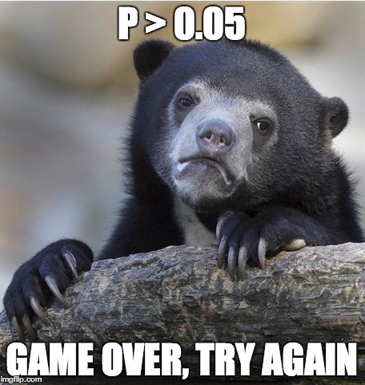

# American Statistical Association to the rescue!?!

## The American Statistical Association

2016

- Ronald L. Wasserstein & Nicole A. Lazar (2016) [The ASA's Statement on p-Values: Context, Process, and Purpose](https://www.tandfonline.com/doi/full/10.1080/00031305.2016.1154108), *The American Statistician*, 70:2, 129-133, DOI: [10.1080/00031305.2016.1154108](https://doi.org/10.1080/00031305.2016.1154108)


2019

- Ronald L. Wasserstein, Allen L. Schirm & Nicole A. Lazar (2019) [Moving to a World Beyond "p < 0.05"](https://www.tandfonline.com/doi/full/10.1080/00031305.2019.1583913), *The American Statistician*, 73:sup1, 1-19, DOI: [10.1080/00031305.2019.1583913](https://doi.org/10.1080/00031305.2019.1583913). 

## Statistical Inference in the 21st Century

> ... a world learning to venture beyond "p < 0.05"

> This is a world where researchers are free to treat "p = 0.051" and "p = 0.049" as not being categorically different, where authors no longer find themselves constrained to selectively publish their results based on a single magic number. 

## Statistical Inference in the 21st Century {.smaller}

> In this world, where studies with "p < 0.05" and studies with "p > 0.05" are not automatically in conflict, researchers will see their results more easily replicated -- and, even when not, they will better understand why.

> The 2016 ASA Statement on P-Values and Statistical Significance started moving us toward this world. As of the date of publication of this special issue, the statement has been viewed over 294,000 times and cited over 1700 times-an average of about 11 citations per week since its release. Now we must go further.

## The American Statistical Association Statement on P values and Statistical Significance

The ASA Statement (2016) was mostly about what **not** to do.

The 2019 effort represents an attempt to explain what to do.

## ASA 2019 Statement

> Some of you exploring this special issue of The American Statistician might be wondering if it's a scolding from pedantic statisticians lecturing you about what not to do with p-values, without
offering any real ideas of what to do about the very hard problem of separating signal from noise in data and making decisions under uncertainty. Fear not. In this issue, thanks to 43 innovative
and thought-provoking papers from forward-looking statisticians, help is on the way.

## "Don't" is not enough. 

> If you're just arriving to the debate, here's a sampling of what not to do.

- Don't base your conclusions solely on whether an association or effect was found to be "statistically significant" (i.e., the *p* value passed some arbitrary threshold such as p < 0.05).
- Don't believe that an association or effect exists just because it was statistically significant.

## "Don't" is not enough. 

- Don't believe that an association or effect is absent just because it was not statistically significant.
- Don't believe that your p-value gives the probability that chance alone produced the observed association or effect or the probability that your test hypothesis is true.
- Don't conclude anything about scientific or practical importance based on statistical significance (or lack thereof).


## Problems with *p* Values

1. *P* values are inherently unstable
2. The *p* value, or statistical significance, does not measure the size of an effect or the importance of a result
3. Scientific conclusions should not be based only on whether a *p* value passes a specific threshold
4. Proper inference requires full reporting and transparency
5. By itself, a *p* value does not provide a good measure of evidence regarding a model or hypothesis

<http://jamanetwork.com/journals/jamaotolaryngology/fullarticle/2546529>

## One More Don't...

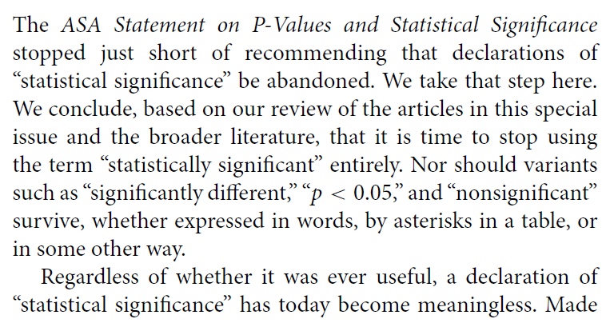

> A label of statistical significance adds nothing to what is already conveyed by the value of *p*; in fact, this dichotomization of *p*-values makes matters worse.

## Gelman on *p* values, 1

> The common practice of dividing data comparisons into categories based on significance levels is terrible, but it happens all the time.... so it's worth examining the prevalence of this error. Consider, for example, this division: 

- "really significant" for *p* < .01, 
- "significant" for *p* < .05, 
- "marginally significant" for *p* < .1, and 
- "not at all significant" otherwise. 

## Gelman on *p* values, 2

Now consider some typical *p*-values in these ranges: say, *p* = .005, *p* = .03, *p* = .08, and *p* = .2. 

Translate these two-sided *p*-values back into z-scores...

Description | really sig. | sig. | marginally sig.| not at all sig.
---------: | ----: | ----: | ----: | ----:
*p* value | 0.005 | 0.03 | 0.08 | 0.20
Z score | 2.8 | 2.2 | 1.8 | 1.3

## Gelman on *p* values, 3

The seemingly yawning gap in p-values comparing the not at all significant *p*-value of .2 to the really significant *p*-value of .005, is only a z score of 1.5. 

If you had two independent experiments with z-scores of 2.8 and 1.3 and with equal standard errors and you wanted to compare them, you'd get a difference of 1.5 with a standard error of 1.4, which is completely consistent with noise.

## Gelman on *p* values, 4

From a **statistical** point of view, the trouble with using the p-value as a data summary is that the p-value can only be interpreted in the context of the null hypothesis of zero effect, and (much of the time), nobody's interested in the null hypothesis. 

Indeed, once you see comparisons between large, marginal, and small effects, the null hypothesis is irrelevant, as you want to be comparing effect sizes.

## Gelman on *p* values, 5

From a **psychological** point of view, the trouble with using the p-value as a data summary is that this is a kind of deterministic thinking, an attempt to convert real uncertainty into firm statements that are just not possible (or, as we would say now, just not replicable).

**The key point**: The difference between statistically significant and NOT statistically significant is not, generally, statistically significant.

<http://andrewgelman.com/2016/10/15/marginally-significant-effects-as-evidence-for-hypotheses-changing-attitudes-over-four-decades/>

## So what is the problem?

If I have to boil it down to one thing, it's not that p values or confidence intervals are inherently bad data summaries, although their interpretation is by no means straightforward.

It's that the whole notion of statistical significance is the problem.

- Working your data to provide a single "yes/no" answer instead of embracing its variation and understanding what the data suggest thoroughly is the problem.

## Nuzzo: *Nature* Statistical Errors

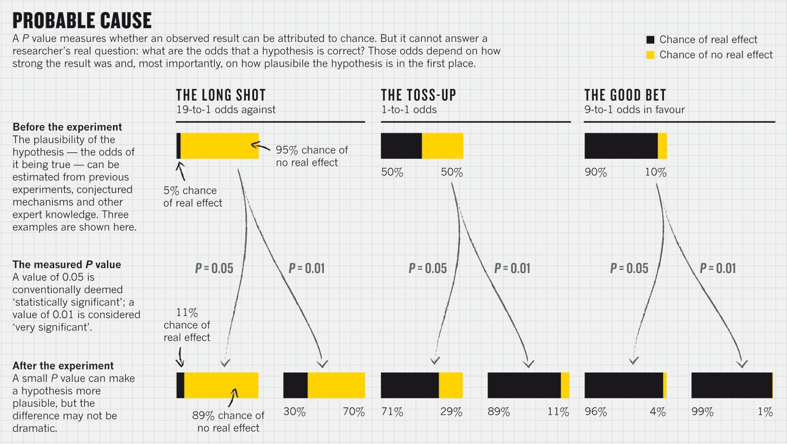

## Are P values all that bad?

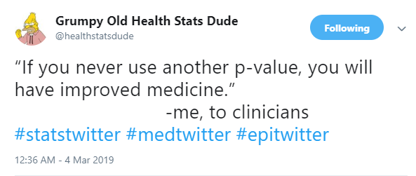


---

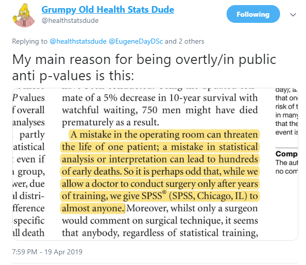

## ASA Statement on *p* Values {.smaller}

ASA Statement: "Informally, a p-value is the probability under a specified statistical model that a statistical summary of the data (e.g., the sample mean difference between two compared groups) would be equal to or more extreme than its observed value."

... Try to distill the p-value down to an intuitive concept and it loses all its nuances and complexity, said science journalist Regina Nuzzo, a statistics professor at Gallaudet University. "Then people get it wrong, and this is why statisticians are upset and scientists are confused." **You can get it right, or you can make it intuitive, but it's all but impossible to do both.**

(This quote comes from the much-lamented fivethirtyeight.com website.)

## A Few Comments on Significance {.smaller}

- **A significant effect is not necessarily the same thing as an interesting effect.**  For example, results calculated from large samples are nearly always "significant" even when the effects are quite small in magnitude.  Before doing a test, always ask if the effect is large enough to be of any practical interest.  If not, why do the test?

- **A non-significant effect is not necessarily the same thing as no difference.**  A large effect of real practical interest may still produce a non-significant result simply because the sample is too small.

- **There are assumptions behind all statistical inferences.** Checking assumptions is crucial to validating the inference made by any test or confidence interval.

- "**Scientific conclusions and business or policy decisions should not be based only on whether a p-value passes a specific threshold.**"

[ASA 2016 statement](http://amstat.tandfonline.com/doi/pdf/10.1080/00031305.2016.1154108) on *p* values


## p = 0.05? {.smaller}

> "For decades, the conventional p-value threshold has been 0.05," says Dr. Paul Wakim, chief of the biostatistics and clinical epidemiology service at the National Institutes of Health Clinical Center, "but it is extremely important to understand that this 0.05, there's nothing rigorous about it. It wasn't derived from statisticians who got together, calculated the best threshold, and then found that it is 0.05. No, it's Ronald Fisher, who basically said, 'Let's use 0.05,' and he admitted that it was arbitrary."

- NOVA "[Rethinking Science's Magic Number](http://www.pbs.org/wgbh/nova/next/body/rethinking-sciences-magic-number/)" by Tiffany Dill 2018-02-28. See especially the video labeled "Science's most important (and controversial) number has its origins in a British experiment involving milk and tea."

## More from Dr. Wakim... {.smaller}

> "People say, 'Ugh, it's above 0.05, I wasted my time.' No, you didn't waste your time." says Dr. Wakim. "If the research question is important, the result is important. Whatever it is."

- NOVA Season 45 Episode 6 [\textcolor{blue}{Prediction by the Numbers}](http://www.pbs.org/video/prediction-by-the-numbers-hg2znc/) 2018-02-28.

## p values don't trend...


## All the p values {.smaller}

> The p-value is the most widely-known statistic. P-values are reported in a large majority of scientific publications that measure and report data. R.A. Fisher is widely credited with inventing the p-value. If he was cited every time a p-value was reported his paper would have, at the very least, 3 million citations - making it the most highly cited paper of all time.

- Visit Jeff Leek's [Github for tidypvals package](https://github.com/jtleek/tidypvals)
    - 2.5 million *p* values in 25 scientific fields

**What do you suppose the distribution of those p values is going to look like?**

## 2.5 million p values in 25 scientific fields: Jeff Leek

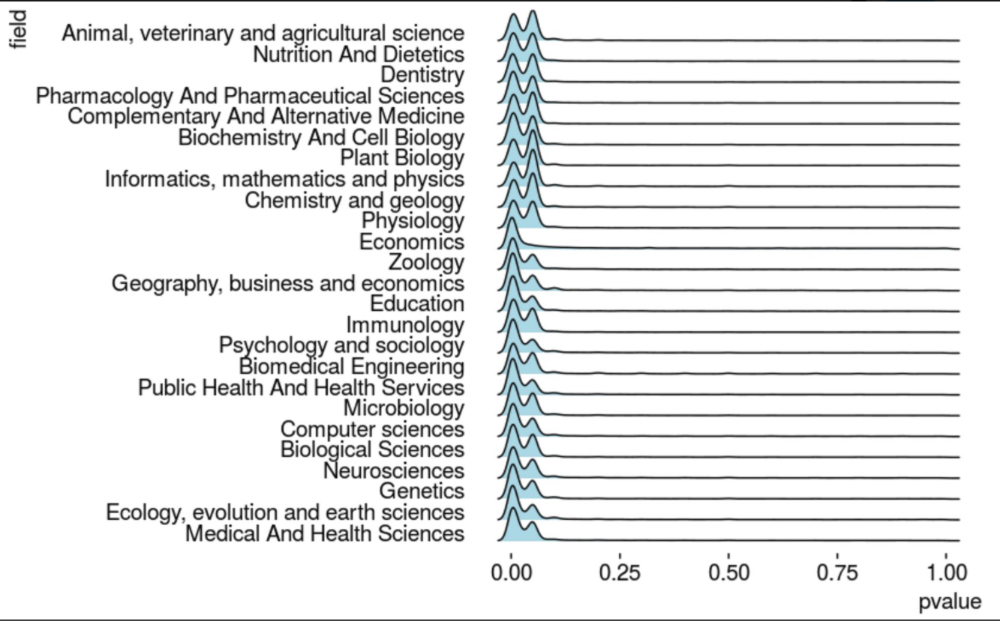

## from Michael Lopez


---

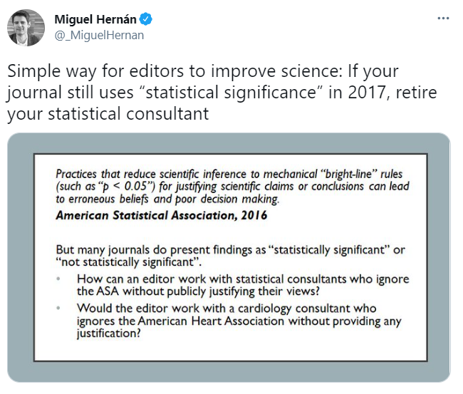

# Standing Break

## Unfortunately...

There are a lot of candidates for the most outrageous misuse of "statistical significance" out there.

---

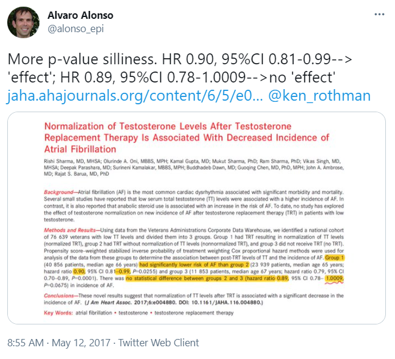

---

```{r, echo = FALSE, fig.align = "left", out.width = '110%'}
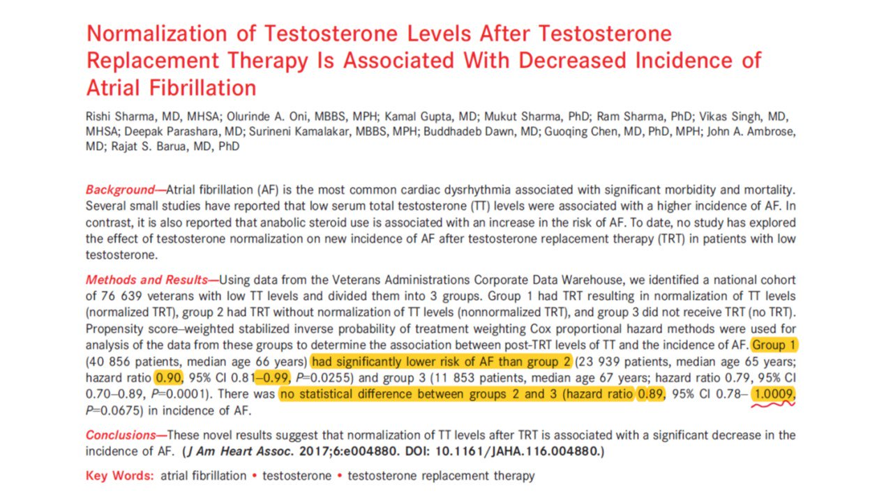
```

---

```{r, echo = FALSE, fig.align = "center", out.width = '120%'}
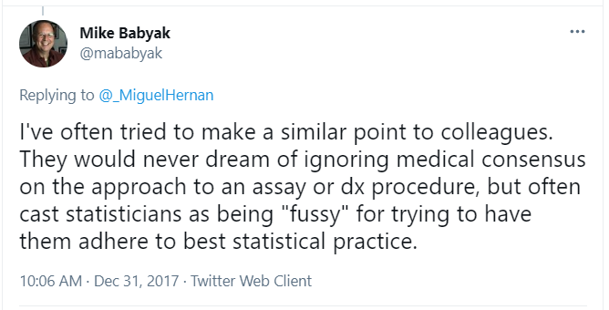
```

---

```{r, echo = FALSE, fig.align = "center", out.width = '120%'}
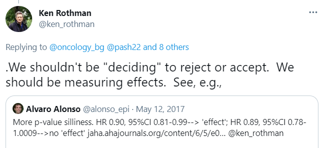
```

## George Cobb's Questions

In February 2014, George Cobb, Professor Emeritus of Mathematics and Statistics at Mount Holyoke College, posed these questions to an ASA discussion forum:

Q: Why do so many colleges and grad schools teach *p* = 0.05?

A: Because that's **still** what the scientific community and journal editors use.

Q: Why do so many people still use *p* = 0.05?

A: Because that's what they were taught in college or grad school.


## "Researcher Degrees of Freedom", 1 {.smaller}

> [I]t is unacceptably easy to publish *statistically significant* evidence consistent with any hypothesis.

> The culprit is a construct we refer to as **researcher degrees of freedom**. In the course of collecting and analyzing data, researchers have many decisions to make: Should more data be collected? Should some observations be excluded? Which conditions should be combined and which ones compared? Which control variables should be considered? Should specific measures be combined or transformed or both?

[Simmons et al.](http://journals.sagepub.com/doi/abs/10.1177/0956797611417632) 

## "Researcher Degrees of Freedom", 2 {.smaller}

> ... It is rare, and sometimes impractical, for researchers to make all these decisions beforehand. Rather, it is common (and accepted practice) for researchers to explore various analytic alternatives, to search for a combination that yields statistical significance, and to then report only what worked. The problem, of course, is that the likelihood of at least one (of many) analyses producing a falsely positive finding at the 5% level is necessarily greater than 5%.

For more, see 

- Gelman's blog [2012-11-01](http://andrewgelman.com/2012/11/01/researcher-degrees-of-freedom/) "Researcher Degrees of Freedom", 
- [Simmons](http://journals.sagepub.com/doi/abs/10.1177/0956797611417632) and others, defining the term.

## And this is really hard to deal with... {.smaller}

**The garden of forking paths**: Why multiple comparisons can be a problem, even when there is no "fishing expedition" or p-hacking and the research hypothesis was posited ahead of time

> Researcher degrees of freedom can lead to a multiple comparisons problem, even in settings
where researchers perform only a single analysis on their data. The problem is there can be a
large number of potential comparisons when the details of data analysis are highly contingent on
data, without the researcher having to perform any conscious procedure of fishing or examining
multiple p-values. We discuss in the context of several examples of published papers where
data-analysis decisions were theoretically-motivated based on previous literature, but where the
details of data selection and analysis were not pre-specified and, as a result, were contingent on
data.

- [Gelman and Loken](http://www.stat.columbia.edu/~gelman/research/unpublished/p_hacking.pdf)

## Abandon Statistical Significance

Gelman blog [2017-09-26](http://andrewgelman.com/2017/09/26/abandon-statistical-significance/) on "Abandon Statistical Significance"

"Measurement error and variation are concerns even if your estimate is more than 2 standard errors from zero. Indeed, if variation or measurement error are high, then you learn almost nothing from an estimate even if it happens to be 'statistically significant.'"

Read the whole paper [here](http://www.stat.columbia.edu/~gelman/research/unpublished/abandon.pdf)

## JAMA 2018-04-10 


## Blume et al. PLoS ONE (2018) 13(3): e0188299


## Second-generation *p* values


## *Nature* P values are just the tip of the iceberg!

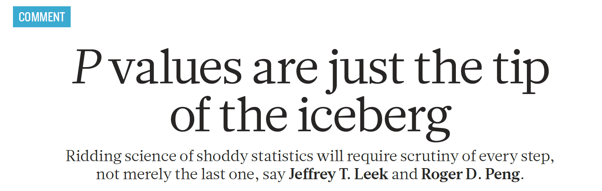

## OK, so what SHOULD we do? {.smaller}

*The American Statistician* Volume 73, 2019, Supplement 1

Articles on:

1. Getting to a Post "*p* < 0.05" Era
2. Interpreting and Using *p*
3. Supplementing or Replacing *p*
4. Adopting more holistic approaches
5. Reforming Institutions: Changing Publication Policies and Statistical Education

- Note that there is an enormous list of "things to do" in Section 7 of the main editorial, too.

## Statistical Inference in the 21st Century

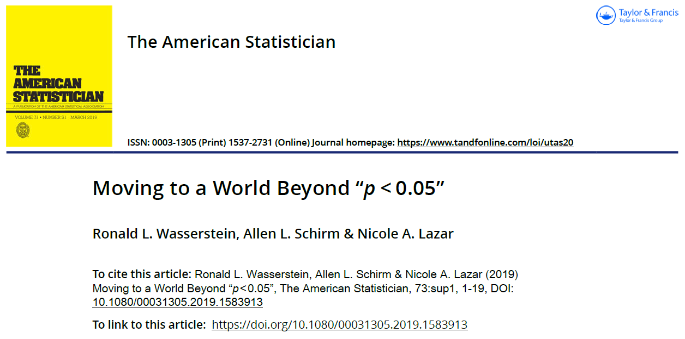

## ATOM: **A**ccept uncertainty. Be **T**houghtful, **O**pen and **M**odest.

- Statistical methods do not rid data of their uncertainty.

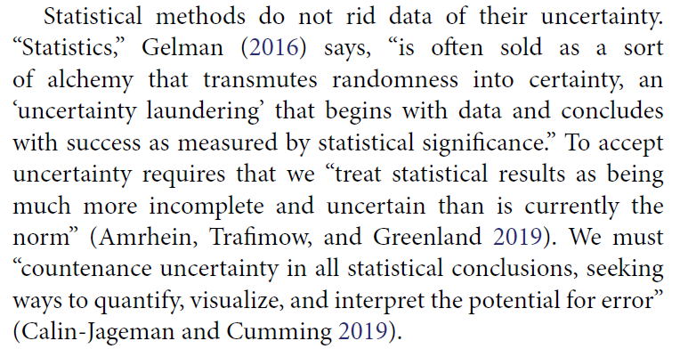


## ATOM: **A**ccept uncertainty. Be **T**houghtful, **O**pen and **M**odest. {.smaller}

> We can make acceptance of uncertainty more natural to our thinking by accompanying every point estimate in our research with a measure of its uncertainty such as a standard error or interval estimate. Reporting and interpreting point and interval estimates should be routine.

> How will accepting uncertainty change anything? To begin, it will prompt us to seek better measures, more sensitive designs, and larger samples, all of which increase the rigor of research.

> It also helps us be modest ... [and] leads us to be thoughtful.

## ATOM: **A**ccept uncertainty. Be **T**houghtful, **O**pen and **M**odest.


## ATOM: **A**ccept uncertainty. Be **T**houghtful, **O**pen and **M**odest.


## ATOM: **A**ccept uncertainty. Be **T**houghtful, **O**pen and **M**odest.


## ATOM: **A**ccept uncertainty. Be **T**houghtful, **O**pen and **M**odest.


## ATOM: **A**ccept uncertainty. Be **T**houghtful, **O**pen and **M**odest.


## ATOM: **A**ccept uncertainty. Be **T**houghtful, **O**pen and **M**odest.


## ATOM: **A**ccept uncertainty. Be **T**houghtful, **O**pen and **M**odest.


## ATOM: **A**ccept uncertainty. Be **T**houghtful, **O**pen and **M**odest.


## ATOM: **A**ccept uncertainty. Be **T**houghtful, **O**pen and **M**odest.


## ATOM: **A**ccept uncertainty. Be **T**houghtful, **O**pen and **M**odest. {.smaller}

> The nexus of openness and modesty is to report everything while at the same time not concluding anything from a single study with unwarranted certainty. Because of the strong desire to inform and be informed, there is a relentless demand to state results with certainty. Again, accept uncertainty and embrace variation in associations and effects, because they are always there, like it or not. Understand that expressions of uncertainty are themselves uncertain. Accept that one study is rarely definitive, so encourage, sponsor, conduct, and publish replication studies.

> Be modest by encouraging others to reproduce your work. Of course, for it to be reproduced readily, you will necessarily have been thoughtful in conducting the research and open in presenting it.

## What I Think I Think Now 

- Null hypothesis significance testing is much harder (and less useful) than I thought.
    - The null hypothesis is almost never a real thing.
    - Rather than rejiggering the cutoff, I have largely abandoned categorizing *p* values
    - Replication is far more useful than I thought it was.

## What I Think I Think Now 

- Some hills aren't worth dying on.
    - Think about uncertainty intervals more than confidence or credible intervals
    - Focus on estimation of effects, rather than "is this effect a big deal or not a big deal?"
- Which method to use is far less important than finding better data
    - The biggest mistake I make regularly is throwing away useful data, and I'm not the only one with this problem.

## What I Think I Think Now 

- The best thing I do most days is communicate more clearly.
    - When stuck in a design, I think about how to get better data.
    - When stuck in an analysis, I try to turn a table into a graph.
- I have A LOT to learn.

